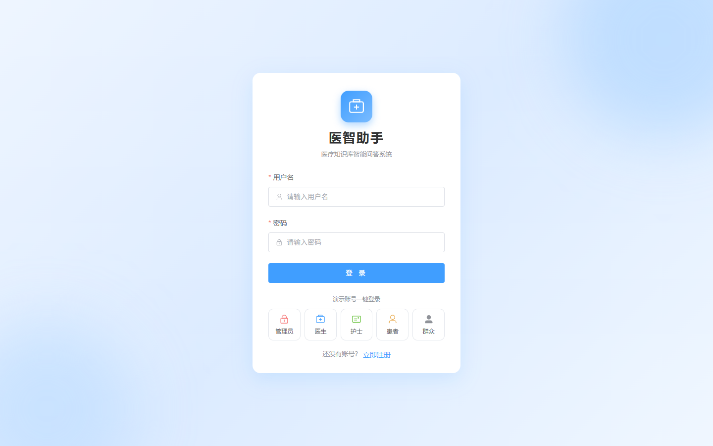
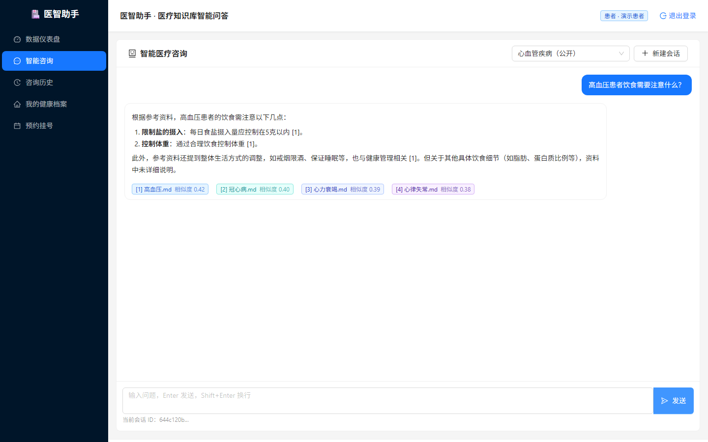
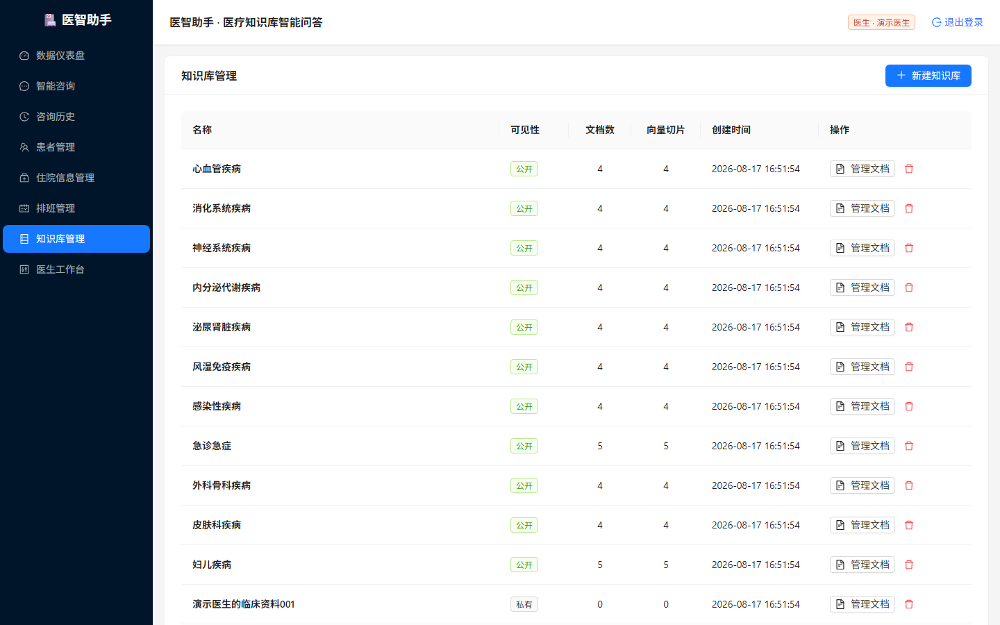
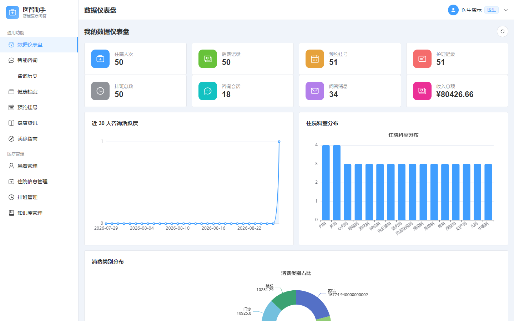
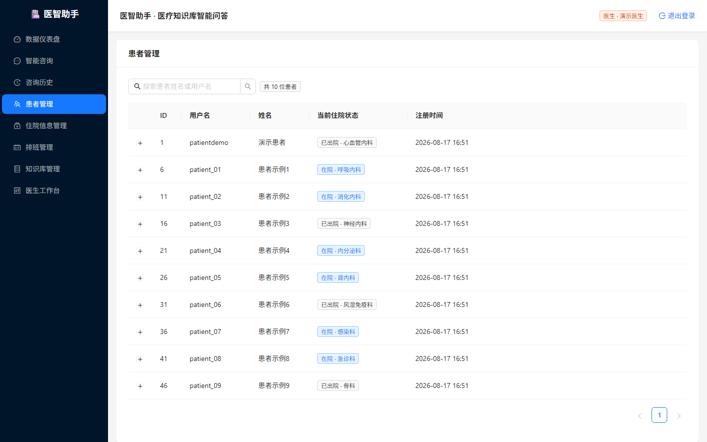
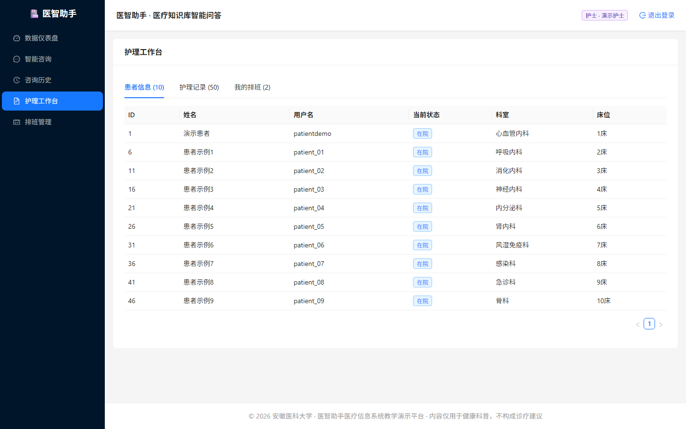
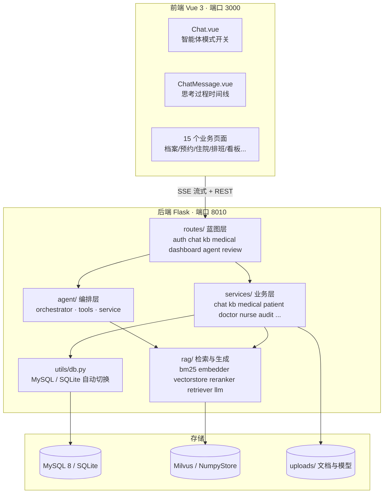
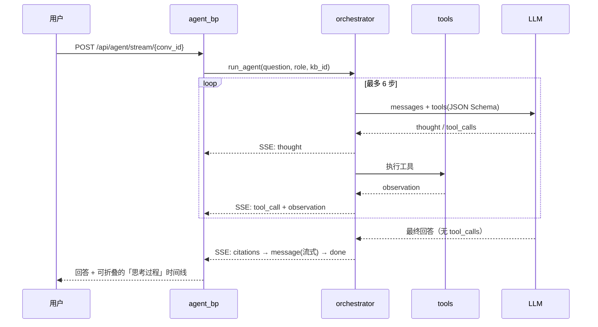

# 医智助手 · 医疗知识库智能问答系统

> 基于 RAG（检索增强生成）的医疗知识库问答平台，并已演进为具备**工具调用、ReAct 推理、人工复核（HITL）与审计追溯**的医疗智能体（Agent）系统。
>
> 面向医院信息系统教学与演示场景，内置 **12 个疾病知识库 + 241 篇医学文档**，提供 **5 种角色门户**。

---

## 一、这个项目的核心看点

| 能力 | 说明 |
|------|------|
| **混合检索 RAG** | BM25 稀疏检索 + 稠密向量检索 + Cross-Encoder 重排三阶段融合，答案可溯源到具体文档片段 |
| **Agent（ReAct）模式** | 前端可一键切换「智能体模式」，后端编排器自主规划并调用工具，思考过程实时可视化 |
| **人工复核 HITL** | AI 回答与知识库文档均需 `pending → approved` 才对患者可见，未复核内容不进入 RAG 上下文 |
| **全链路审计** | 复核动作与关键操作写入 `audit_logs`，管理员可分页追溯 |
| **五级降级容错** | 无 LLM Key / 无 Milvus / 无 BGE 模型，系统自动降级到离线规则式链路，保证「任何时候都能跑起来」 |
| **双数据库** | MySQL 8（生产默认）与 SQLite（零依赖演示）通过 `DB_TYPE` 一键切换 |

---

## 二、效果预览

| 登录页 | 智能咨询 | 知识库管理 |
|--------|----------|------------|
|  |  |  |

| 数据仪表盘 | 患者管理 | 护理工作台 |
|------------|----------|------------|
|  |  |  |

> 完整截图见 [`docs/images/`](docs/images)，另附架构与流程说明：[`Agent项目要点.md`](Agent项目要点.md)、Docker 部署见 [`部署说明.md`](部署说明.md)。

---

## 三、技术栈

**后端** Python 3.11 · Flask 3 · Flask-CORS · PyMySQL · PyJWT · Gunicorn · NumPy

**前端** Vue 3.4 · TypeScript · Vite 5 · Vue Router 4 · Pinia 2 · Element Plus 2.7 · ECharts 5 · Axios

**存储**
- 关系库：MySQL 8（默认）／SQLite（`DB_TYPE=sqlite` 兜底）
- 向量库：Milvus 2.5（`MilvusClient` API）；未启用时自动降级为内置 **NumpyStore**（本地 numpy 持久化，功能等价）
- 嵌入模型：本地 `bge-base-zh-v1.5`（768 维）；加载失败降级为内置**确定性哈希向量**

**大模型** 任意 OpenAI 兼容接口（默认 DeepSeek `/v1`）；未配置 Key 时走内置离线兜底生成

---

## 四、系统架构



### 4.1 一次问答的完整链路

```
用户提问
   │
   ├─ 权限裁剪：_get_visible_kb_ids(role) 按角色算出可见知识库
   │
   ├─ 混合召回：BM25 Top-30  ∪  稠密向量 Top-30
   │
   ├─ 融合重排：Cross-Encoder 打分
   │            0.55×稠密余弦 + 0.30×BM25归一化 + 0.15×词法重叠
   │            取 Top-5（RERANK_TOP_K），低于 0.12 丢弃
   │
   ├─ HITL 过滤：仅保留 review_status='approved' 且 status='ready' 的文档
   │
   ├─ 上下文组装：build_context() 拼装带来源标注的片段
   │
   └─ 流式生成：SSE 逐段推送 + citations 引用来源
```

---

## 五、Agent（智能体）模式

前端「智能咨询」页右上角的开关即可切换。开启后走 `/api/agent/stream/<conv_id>`，由后端编排器自主决策。

### 5.1 执行流程



### 5.2 SSE 事件协议

| 事件 | 载荷 | 说明 |
|------|------|------|
| `thought` | `{content}` | 模型思考文本 |
| `tool_call` | `{name, args}` | 调用了哪个工具、入参是什么 |
| `observation` | `{content}` | 工具返回（截断至 1500 字符） |
| `citations` | `{citations: [...]}` | 最终回答的引用来源 |
| `message` | `{content}` | 最终回答的流式增量 |
| `done` | — | 结束 |
| `error` | `{content}` | 出错或达到最大步数 |

### 5.3 内置工具

| 工具 | 说明 | 数据来源 |
|------|------|----------|
| `search_knowledge` | 检索医学知识库，返回带相关度的片段 | `rag/retriever.py` |
| `get_weather` | 按经纬度查当前天气与今日气温 | Open-Meteo（免 Key） |
| `reverse_geocode` | 经纬度反查城市名 | BigDataCloud（免 Key） |
| `query_hospitalizations` | 按患者/科室/诊断查住院信息 | `hospitalizations` 表 |
| `query_appointments` | 按患者/科室查预约信息 | `appointments` 表 |

**降级策略**：在线编排（`tool_choice=auto`）失败时自动切到离线规则式 Agent——强制检索知识库，问题中检出患者姓名则补查住院记录，保证无 Key 环境下依然可用。

---

## 六、人工复核（HITL）与审计

医疗场景的关键设计：**AI 生成的内容默认不直接对患者可见**。

```
                 ┌─────────────┐
  患者/群众提问 ─▶│  AI 生成回答  │─▶ review_status = pending  ← 默认待复核
                 └─────────────┘
                        │
                        │ 检索时过滤：review_status='approved' AND status='ready'
                        ▼
             未复核内容不进入 RAG 上下文
                        │
   医生/admin 复核 ──────┤─▶ approved  → 可被检索 / 可展示
                        └─▶ rejected  → 丢弃并留痕
```

**状态机**：`pending`（待复核）· `approved`（通过）· `rejected`（驳回）

**默认值**
| 场景 | 初始状态 |
|------|----------|
| 患者 / 群众得到的 AI 回答 | `pending` |
| 医护 / admin 自己的回答 | `approved` |
| 新上传的知识库文档 | `pending` |
| 播种的历史文档 | `approved` |

> 旧库启动时由 `_run_hitl_migrations()` 自动补列并把历史数据标记为 `approved`，不会因升级导致检索为空。

**审计**：复核动作通过 `services/audit_service.py` 落 `audit_logs`（操作人、角色、动作、对象、摘要、来源 IP）。审计写入为**旁路**行为——失败静默，绝不阻断业务主流程。

---

## 七、角色与权限

| 角色 | 知识库可见范围 | 业务功能 |
|------|----------------|----------|
| `patient` 患者 | 仅公开库 | 健康档案、住院查询、消费明细、预约挂号 |
| `public` 群众 | 仅公开库 | 健康资讯、预约挂号（不关联个人健康数据） |
| `nurse` 护士 | 仅公开库 | 护理工作台：患者信息、护理记录录入、排班查看 |
| `doctor` 医生 | 公开库 + **自己名下及平台公共的私有库** | 患者管理、住院信息维护、知识库与文档管理、复核 AI 回答 |
| `admin` 管理员 | **全部**公开库与私有库 | 用户管理、全系统数据看板、复核、审计日志查询 |

前端路由按 `meta.roles` 做页面级守卫，后端每个接口再做一次角色校验，双重把关。

---

## 八、快速开始

### 8.1 方式一：Docker 一键启动（推荐）

```bash
cp .env.example .env          # 按需修改 OPENAI_API_KEY
docker compose up -d --build
```

| 服务 | 地址 | 说明 |
|------|------|------|
| 前端 | http://localhost:3000 | Nginx 托管静态资源 |
| 后端 | http://localhost:8010/api/health | Gunicorn |
| MySQL | `localhost:3307` | 容器内 3306 |
| Milvus | `localhost:19530` | 向量库 |
| Attu | http://localhost:8000 | Milvus 可视化管理 |

编排包含 7 个服务：`mysql` `etcd` `minio` `milvus` `attu` `backend` `frontend`。首次启动自动建库建表并播种演示数据。

```bash
docker compose logs -f backend     # 查看后端日志
docker compose down                # 停止（保留数据卷）
docker compose down -v             # 停止并清空数据卷
```

### 8.2 方式二：本地独立部署

**1）后端**

```bash
# 注意：务必使用 backend/requirements.txt
# 根目录的 requirements.txt 是本机 Anaconda 全量 freeze 产物，不适用
python -m venv .venv && source .venv/bin/activate      # Windows: .venv\Scripts\activate
pip install -r backend/requirements.txt

cp .env.example .env
python -m backend                  # 从项目根目录执行 → http://127.0.0.1:8010
```

启动流程：建库建表 → 空库自动播种 → 后台线程预热向量库 → 启动 Flask。

**2）前端**

```bash
cd frontend
npm install
npm run dev                        # → http://localhost:5173
npm run build                      # 生产构建，产物由 Nginx 托管
```

**3）生产环境**

```bash
gunicorn wsgi:app -w 4 -b 0.0.0.0:8010
```

> `wsgi.py` 会在导入时先执行 `init_database()`，与本地运行行为一致。

---

## 九、环境变量

以下变量由 `backend/config.py` 实际读取（`.env` 放在项目根目录或 `backend/` 均可）。

### 数据库

| 变量 | 默认值 | 说明 |
|------|--------|------|
| `DB_TYPE` | `mysql` | `mysql` 或 `sqlite` |
| `DATABASE_NAME` | `medical-assistant-master` | 库名，同时决定 SQLite 文件名 |
| `MYSQL_HOST` / `MYSQL_PORT` | `127.0.0.1` / `3306` | MySQL 地址 |
| `MYSQL_USER` / `MYSQL_PASSWORD` | `root` / `123456` | MySQL 凭据 |

### 向量库

| 变量 | 默认值 | 说明 |
|------|--------|------|
| `MILVUS_ENABLE` | `1` | 置 `0` 则使用内置 NumpyStore |
| `MILVUS_HOST` / `MILVUS_PORT` | `127.0.0.1` / `19530` | Milvus 地址 |
| `MILVUS_CONNECT_TIMEOUT` | `3` | 连不上时快速失败并降级，不阻塞启动 |

### 模型与 RAG

| 变量 | 默认值 | 说明 |
|------|--------|------|
| `OPENAI_BASE_URL` | `https://api.deepseek.com/v1` | 任意 OpenAI 兼容端点 |
| `OPENAI_API_KEY` | 空 | 留空即启用离线兜底链路 |
| `OPENAI_CHAT_MODEL` | `deepseek-chat` | 聊天模型 |
| `OPENAI_EMBED_MODEL` | 空 | BGE 模型目录或 HF id；留空用哈希向量 |
| `EMBED_DIM` | `768` | 必须与向量模型维度一致 |
| `CHUNK_SIZE` / `CHUNK_OVERLAP` | `500` / `80` | 文档切分参数 |
| `TOP_K` / `MIN_SIMILARITY` | `5` / `0.30` | 召回条数与相似度下限 |
| `BM25_TOP_K` / `DENSE_TOP_K` | `30` / `30` | 两路召回的候选量 |
| `RERANK_TOP_K` / `RERANK_MIN_SCORE` | `5` / `0.12` | 重排保留条数与分数下限 |
| `RERANK_W_DENSE` / `W_BM25` / `W_LEXICAL` | `0.55` / `0.30` / `0.15` | 重排融合权重 |

### 其他

| 变量 | 默认值 | 说明 |
|------|--------|------|
| `BACKEND_PORT` | `8010` | 后端监听端口 |
| `JWT_SECRET` | 内置默认值 | **生产环境必须修改** |
| `JWT_EXP_HOURS` | `24` | Token 有效期 |

---

## 十、演示账号

密码统一为 **`demo123`**。

| 账号 | 角色 | 可体验的功能 |
|------|------|--------------|
| `patientdemo` | 患者 | 公开库问答、健康档案、住院与消费查询、预约挂号 |
| `doctordemo` | 医生 | 知识库与文档管理、患者管理、住院维护、**AI 回答复核** |
| `nursedemo` | 护士 | 护理工作台、护理记录、排班查看 |
| `publicdemo` | 群众 | 健康资讯、公开库问答、预约挂号 |
| `admindemo` | 管理员 | 全部功能 + 用户管理 + 全系统看板 + **审计日志** |

> 播种还会额外生成 `doctor01~16`、`nurse01~08`、`patient01~30`、`public01~05` 等账号，密码相同，用于演示多用户数据。

---

## 十一、API 一览

所有接口前缀 `/api`，除登录注册外均需 `Authorization: Bearer <token>`。

| 蓝图 | 前缀 | 主要端点 |
|------|------|----------|
| `auth_bp` | `/api/auth` | `POST /login` `POST /register` `GET /me` · 用户 CRUD |
| `chat_bp` | `/api/chat` | 会话 CRUD · `POST /stream/<conv_id>`（SSE）· `GET /history` |
| `agent_bp` | `/api/agent` | `GET /tools` · `POST /stream/<conv_id>`（SSE） |
| `kb_bp` | `/api/kb` | 知识库 CRUD · `GET|POST /<kb_id>/documents` · `DELETE /documents/<id>` |
| `medical_bp` | `/api/medical` | `hospitalizations` `bills` `appointments` `nursing-records` `schedules` |
| `dashboard_bp` | `/api/dashboard` | `overview` `users` `knowledge-bases` `business` `chat` `revenue` 及两类分布 |
| `review_bp` | `/api/review` | `GET /answers` · `POST /answers/<id>/approve\|reject` · `GET /documents` · `POST /documents/<id>/approve\|reject` · `GET /audit` |
| — | `/api/health` | 健康检查，返回 `{status, db_type}` |
| — | `/api/vector/status` | 向量库后端、嵌入模型、聊天模型 |

复核类接口仅 `doctor`/`admin` 可调用，`/api/review/audit` 仅 `admin`。

---

## 十二、数据库设计

启动时由 `init_schema()` 幂等建表，共 **16 张业务表**。

| 分类 | 表 |
|------|-----|
| 身份 | `users` |
| 知识库 | `knowledge_bases` `documents` `chunks` `sub_chunks` `bm25_terms` `chunk_vectors` |
| 问答 | `conversations` `messages`（含 `review_status`、`agent_steps`）`citations` |
| 业务 | `hospitalizations` `bills` `appointments` `nursing_records` `schedules` |
| 合规 | `audit_logs` |

**设计要点**
- `chunks` / `sub_chunks` 父子块结构：父块保留完整章节上下文，子块作为检索单元，兼顾召回精度与上下文完整性。
- 不使用外键约束，引用完整性由应用层保证（跨 MySQL 版本/字符集更省心）。
- SQLite 版 `schema.sql` 与 MySQL 版 `schema_mysql.sql` 字段一一对应；`ON UPDATE CURRENT_TIMESTAMP` 在 SQLite 不受支持，相关字段由应用层显式写入。

---

## 十三、项目结构

```
medical_assistant-master/
├── backend/
│   ├── app.py                 # 应用入口：create_app() + init_database()
│   ├── wsgi.py                # Gunicorn 入口（项目根目录）
│   ├── config.py              # 全局配置（.env 加载）
│   ├── seed.py                # 演示数据播种（空库自动触发）
│   ├── reindex.py             # 向量库重建
│   ├── agent/                 # ★ Agent 编排层
│   │   ├── orchestrator.py    #   ReAct 循环（在线 6 步 / 离线规则式降级）
│   │   ├── tools.py           #   工具抽象：5 个内置工具
│   │   └── service.py         #   SSE 事件封装与落库
│   ├── routes/                # 蓝图层（7 个）
│   ├── services/              # 业务层（chat / kb / medical / audit / ...）
│   ├── rag/                   # 检索与生成
│   │   ├── bm25.py            #   稀疏检索
│   │   ├── embedder.py        #   BGE 本地模型 + 哈希兜底
│   │   ├── vectorstore.py     #   MilvusStore + NumpyStore
│   │   ├── reranker.py        #   Cross-Encoder 融合重排
│   │   ├── retriever.py       #   三阶段混合检索 + 权限裁剪
│   │   ├── chunker.py         #   父子块切分
│   │   └── llm.py             #   流式生成 + 输出清洗
│   ├── utils/                 # db / jwt / file_parser / text_utils
│   ├── models/                # schema_mysql.sql · schema.sql
│   └── data/                  # uploads（文档）· models（BGE）· *.db（SQLite）
├── frontend/src/
│   ├── views/                 # 15 个页面组件（路由实际引用）
│   ├── components/            # ChatMessage / CitationCard / EChart / MarkdownView
│   ├── api/                   # Axios 封装 + SSE（原生 fetch）
│   ├── router/index.ts        # 路由 + 角色守卫
│   └── stores/auth.ts         # Pinia 登录态
├── docs/images/               # 16 张功能截图
├── docker-compose.yml         # 7 服务编排
└── nginx.conf                 # 前端反向代理
```

---

## 十四、排错指南

| 现象 | 原因与处理 |
|------|------------|
| 启动卡在向量库 | Milvus 未启动。设 `MILVUS_ENABLE=0` 用 NumpyStore，或 `MILVUS_CONNECT_TIMEOUT` 调小快速降级 |
| 检索结果不理想 | 哈希向量语义能力弱。运行 `python backend/download_model.py` 下载 BGE，或设 `OPENAI_EMBED_MODEL` 指向本地模型目录 |
| AI 回答质量差 | 未配 `OPENAI_API_KEY`，当前走离线兜底生成。配置任意 OpenAI 兼容端点即可 |
| 新上传文档检索不到 | 文档默认为 `pending`，需医生/管理员在复核接口审批后才进入 RAG 上下文 |
| 依赖装不上 | 误用了根目录 `requirements.txt`。请改用 `backend/requirements.txt` |
| PDF 解析为空 | 扫描件无文本层，需装 OCR：`pip install -r backend/requirements-ocr.txt` |
| 端口冲突 | 后端 `BACKEND_PORT`（默认 8010）；Docker 下 MySQL 映射到宿主机 **3307** 而非 3306 |

---

## 十五、免责声明

本系统的回答仅用于医疗健康信息的辅助理解，**不构成诊断、处方或治疗建议**。实际医疗问题请咨询专业医生并以执业医师的诊断为准。

请勿将真实账号、数据库密码与 API 密钥提交到版本库——`.env` 已在 `.gitignore` 中排除。

---

## 许可证

[木兰宽松许可证，第 2 版](LICENSE)
