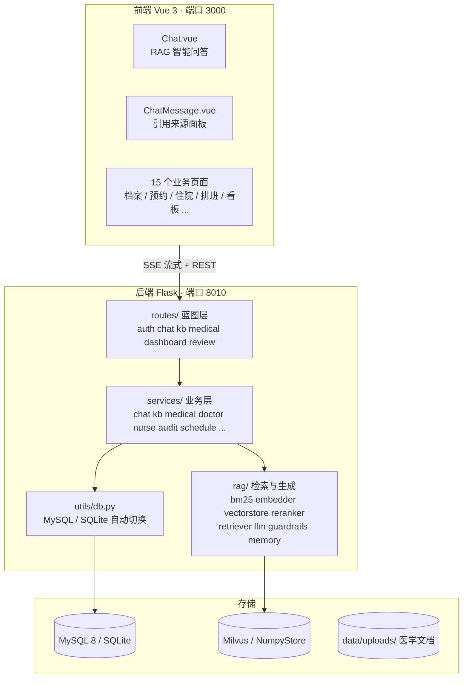

# 医智助手 · Medical Assistant

> 基于 **RAG（检索增强生成）** 的医疗知识库智能问答系统，面向医院信息系统教学与演示场景。
> 内置 **12 个疾病知识库、483 篇医学文档**，提供 **5 种角色门户**，开箱即用：Docker 一键启动，无外部大模型 Key、无 Milvus 也能完整运行。


---

## 目录

- [一、功能特性](#一功能特性)
- [二、界面预览](#二界面预览)
- [三、技术栈](#三技术栈)
- [四、系统架构](#四系统架构)
- [五、安全护栏与上下文增强](#五安全护栏与上下文增强)
- [六、人工复核（HITL）与审计](#六人工复核hitl与审计)
- [七、角色与权限](#七角色与权限)
- [八、快速开始（Docker / 本地 / 生产）](#八快速开始docker--本地--生产)
- [九、环境变量](#九环境变量)
- [十、演示账号](#十演示账号)
- [十一、API 一览](#十一api-一览)
- [十二、数据库设计](#十二数据库设计)
- [十三、项目结构](#十三项目结构)
- [十四、评测与复现](#十四评测与复现)
- [十五、常见问题](#十五常见问题)
- [十六、参与贡献](#十六参与贡献)
- [十七、免责声明与许可证](#十七免责声明与许可证)

---

## 一、功能特性

| 能力 | 说明 |
|------|------|
| **混合检索 RAG** | BM25 稀疏检索 + BGE 稠密向量 + 融合重排 v4（实体地板 / 证据分 / 泛化词剔除），答案可溯源到具体文档片段，生产等价评测 Hit@1 = 100% |
| **安全护栏** | 急危重症关键词命中即直接返回急救指引（跳过检索与 LLM）；最终回答强制附带免责声明，医疗场景安全兜底 |
| **用户画像注入** | 回答前自动检索当前用户近期病史 / 预约并注入系统提示，实现个性化回答（如过敏史提醒） |
| **人工复核 HITL** | AI 回答、知识库文档与预约写操作均需 `pending → approved` 才生效，未复核内容不进入 RAG 上下文 |
| **全链路审计** | 复核动作与关键写操作落 `audit_logs`，管理员可分页追溯（操作人 / 角色 / 来源 IP） |
| **多级降级容错** | 无 LLM Key、无 Milvus、无 BGE 模型、无 GPU 均自动降级到离线规则链路——"任何时候都能跑起来" |
| **双数据库** | MySQL 8（生产默认）与 SQLite（零依赖演示）通过 `DB_TYPE` 一键切换 |

> 完整架构设计文档见 [`面试准备/项目完整架构与流程图.md`](面试准备/项目完整架构与流程图.md)；系统总体架构图见 [`面试准备/0-系统总体架构图.png`](面试准备/0-系统总体架构图.png)，9 张业务流程图见 [`面试准备/流程图/`](面试准备/流程图)，答辩材料见 [`面试准备/医智助手-项目答辩.pptx`](面试准备/医智助手-项目答辩.pptx) 与 [`面试准备/面试要点.md`](面试准备/面试要点.md)。

---

## 二、界面预览

| 登录页 | 智能咨询 | 知识库管理 |
|--------|----------|------------|
|  |  |  |

| 数据仪表盘 | 患者管理 | 护理工作台 |
|------------|----------|------------|
|  |  |  |

> 完整 16 张功能截图见 [`docs/images/`](docs/images)（01~15 号：登录、仪表盘、咨询、历史、档案、预约、资讯、就诊指南、医生工作台、患者管理、住院、排班、知识库、护理、系统管理）。

---

## 三、技术栈

**后端** Python 3.11 · Flask 3 · Flask-CORS · PyMySQL · PyJWT · Gunicorn · NumPy

**前端** Vue 3.4 · TypeScript · Vite 5 · Vue Router 4 · Pinia 2 · Element Plus 2.7 · ECharts 5 · Axios

**存储与模型**
- 关系库：MySQL 8（默认）／SQLite（`DB_TYPE=sqlite` 兜底）
- 向量库：Milvus 2.5（`MilvusClient` API）；未启用时自动降级为内置 **NumpyStore**（numpy 持久化，功能等价）
- 嵌入模型：本地 `bge-base-zh-v1.5`（768 维，自动检测）；加载失败降级为内置确定性哈希向量
- 重排增强（可选）：Cross-Encoder `bge-reranker-*`（A/B 实测后默认关闭，见[十四、评测与复现](#十四评测与复现)）

**大模型** 任意 OpenAI 兼容接口（默认 DeepSeek `/v1`）；未配置 Key 时走内置离线兜底生成

---

## 四、系统架构



### 4.1 一次问答的完整链路（RAG 侧）

```
用户提问
   │
   ├─ 输入护栏：命中急危重症关键词 → 直接返回急救指引（跳过检索与 LLM）
   │
   ├─ 权限裁剪：按角色（patient/public/nurse/doctor/admin）算出可见知识库范围
   │
   ├─ 混合召回：BM25 Top-30（jieba 分词）  ∪  稠密向量 Top-30（BGE 语义）
   │
   ├─ 融合重排 v4（毫秒级）：BGE 余弦为主信号，融合 BM25 归一化 + 多粒度词法重叠
   │   · 实体地板 0.90 + 0.10×证据分（修复 BM25 高分反被压过）
   │   · 泛化词（儿童 / 急诊 / 康复…）不再授予高地板，杜绝高分噪声
   │   · 反向包含：查询实体词 ∈ 标题即命中；展示校准：实体命中展示分 ≥0.95
   │   取 Top-8（RERANK_TOP_K），低于 0.45（RERANK_MIN_SCORE）丢弃
   │
   ├─ HITL 过滤：仅保留 review_status='approved' 且 status='ready' 的文档
   │
   ├─ 上下文组装：build_context() 拼装带来源标注的片段 + 注入用户画像（近期病史/预约）
   │
   ├─ 流式生成：SSE 逐段推送 + citations 引用来源
   │
   └─ 输出护栏：确保回答末尾附带免责声明
```

---

## 五、安全护栏与上下文增强

RAG 主链路（`/api/chat/stream/<conv_id>`）在检索问答前后叠加三层医疗安全能力，全部实现在 `backend/rag/` 内：

### 5.1 输入护栏：急危重症拦截（`rag/guardrails.py`）

用户问题命中紧急症状关键词（胸痛 / 呼吸困难 / 昏迷 / 大出血等）时，**直接返回急救指引**（拨打 120、原地休息、CPR 等），跳过检索与 LLM 生成，避免危重情况下的常规问答延误救治。

### 5.2 输出护栏：免责声明（`rag/guardrails.py`）

LLM 系统提示已要求回答附带免责提醒；落库前再执行 `ensure_disclaimer()` 兜底——若最终回答缺失免责内容，自动补发一个 SSE 增量帧追加标准免责声明，保证每条 AI 回答都明确"不能替代执业医师诊断"。

### 5.3 用户画像注入（`rag/memory.py`）

回答前通过 `get_enhanced_user_context()` 检索当前用户的：

- 身份与近期住院诊断（`hospitalizations` 表最近 3 条）；
- 近期预约记录（`appointments` 表最近 3 条）；
- 上次咨询摘要（最近一条 AI 回答前 100 字）。

拼装为「用户长期记忆」片段注入系统提示，让回答具备个性化（医疗安全硬需求，如过敏史提醒）。

### 5.4 SSE 事件协议

| 帧 | 载荷 | 说明 |
|------|------|------|
| `citations` | `{citations: [...]}` | 检索到的引用来源（回答开始前推送） |
| `content` | `{content}` | 最终回答的流式增量 |
| `done` | `{done: true}` | 结束 |
| `error` | `{error}` | 出错（随后自动降级到离线兜底生成） |

---

## 六、人工复核（HITL）与审计

医疗场景的关键设计：**AI 生成的内容默认不直接对患者可见**。

```
                 ┌─────────────┐
  患者/群众提问 ─▶│  AI 生成回答  │─▶ review_status = pending  ← 默认待复核
                 └─────────────┘
                        │
                        │ 检索时过滤：review_status='approved' AND status='ready'
                        ▼
             未复核内容不进入 RAG 上下文
                        │
   医生/admin 复核 ──────┤─▶ approved  → 可被检索 / 可展示
                        └─▶ rejected  → 丢弃并留痕
```

**状态机**：`pending`（待复核）· `approved`（通过）· `rejected`（驳回）

**默认值**

| 场景 | 初始状态 |
|------|----------|
| 患者 / 群众得到的 AI 回答 | `pending` |
| 医护 / admin 自己的回答 | `approved` |
| 新上传的知识库文档 | `pending` |
| 播种的历史文档 | `approved` |
| AI 发起的预约请求（`create_appointment`） | `pending`，医生在复核台批准后建单 |

**审计**：复核动作通过 `services/audit_service.py` 落 `audit_logs`（操作人、角色、动作、对象、摘要、来源 IP）。审计写入为**旁路**行为——失败静默，绝不阻断业务主流程。

---

## 七、角色与权限

| 角色 | 知识库可见范围 | 业务功能 |
|------|----------------|----------|
| `patient` 患者 | 仅公开库 | 健康档案、住院查询、消费明细、预约挂号 |
| `public` 群众 | 仅公开库 | 健康资讯、预约挂号（不关联个人健康数据） |
| `nurse` 护士 | 仅公开库 | 护理工作台：患者信息、护理记录录入、排班查看 |
| `doctor` 医生 | 公开库 + **自己名下及平台公共的私有库** | 患者管理、住院信息维护、知识库与文档管理、复核 AI 回答与预约请求 |
| `admin` 管理员 | **全部**公开库与私有库 | 用户管理、全系统数据看板、复核、审计日志查询 |

前端路由按 `meta.roles` 做页面级守卫，后端每个接口再做一次角色校验，双重把关。

---

## 八、快速开始（Docker / 本地 / 生产）

### 8.1 方式一：Docker Compose 一键部署（推荐）

> 当前编排与 `docker-compose.yml` 实测一致；**不含 Redis**（历史文档中提及的 Redis 缓存层已下线，`backend/services/cache.py` 为死代码，未在任何模块被引用）。

```bash
# 1. 准备环境变量（按需修改 OPENAI_API_KEY 等）
cp .env.example .env

# 2. 构建并后台启动（首次构建较久，约数分钟至十余分钟）
docker compose up -d --build

# 3. 查看状态与日志
docker compose ps
docker compose logs -f backend
```

**服务清单（7 个容器）**

| 服务 | 镜像 / 构建 | 端口（宿主 → 容器） | 用途 |
|------|-------------|---------------------|------|
| `mysql` | mysql:8.0 | 3307 → 3306 | 业务库（用户 / 知识库 / 会话 / 引用），启动自动建表 |
| `etcd` | quay.io/coreos/etcd:v3.5.16 | —（内部网络） | Milvus 元数据 |
| `minio` | minio/minio:latest | —（内部网络） | Milvus 对象存储 |
| `milvus` | milvusdb/milvus:v2.5.6 | 19530 / 9091 | 向量数据库（语义检索） |
| `attu` | zilliz/attu:v2.5.12 | 8000 → 3000 | Milvus 可视化管理台 |
| `backend` | 本地构建 `backend/Dockerfile.backend` | 8010 → 8010 | Flask RAG 问答（Gunicorn 4 进程 × 2 线程） |
| `frontend` | 本地构建 `frontend/Dockerfile.frontend` | 3000 → 80 | Nginx 托管静态资源并反代后端 |

**访问地址**

| 入口 | 地址 |
|------|------|
| 前端 | http://localhost:3000 |
| 后端健康检查 | http://localhost:8010/api/health |
| Milvus 管理台（Attu） | http://localhost:8000 |

**首次启动**会建库建表、播种 12 个知识库 483 篇文档与 5 类演示账号、预热向量库（耗时较长，`start_period` 已放宽至 300s）。

**常用运维命令**

```bash
docker compose ps                    # 查看健康状态
docker compose logs -f backend       # 查看后端日志
docker compose restart mysql         # 单独重启某服务
docker compose down                  # 停止（保留数据卷）
docker compose down -v               # 停止并清空数据卷（谨慎，向量需重新索引）
```

**构建与运行要点（实测校准）**
- 镜像构建默认走**阿里云 PyPI 镜像**（国内约 10× 提速）；海外环境构建时覆盖：`docker compose build --build-arg PIP_INDEX_URL=https://pypi.org/simple`
- 向量库客户端固定 **pymilvus 3.x**（`backend/requirements.txt` 锁定 `>=3.0.1,<3.1.0`）。**请勿改回 2.x**：2.3.x 的 `MilvusClient` 无 `flush` 方法，播种向量无法落盘（`row_count=0`，知识库为空）；2.4/2.5 的 `flush` 形参为列表亦不兼容
- 后端以 gunicorn `--preload` 启动（配置见 [`gunicorn.conf.py`](gunicorn.conf.py)）：master 进程只执行一次 `init_database()`，避免多 worker 重复播种；`post_fork` 钩子重置 vectorstore 单例，修复 pymilvus gRPC 连接被 worker 共享导致的 SSE 检索挂起
- 默认挂载宿主 `backend/data/models` 并启用本地 BGE 模型（`OPENAI_EMBED_MODEL=auto`）；不需要真实语义向量时可在 compose 中关闭 `INSTALL_LOCAL_EMBED` 以换取更小的镜像
- 若清卷重建（`down -v`）后知识库为空而日志无报错，通常是空卷陷阱：`docker volume rm -f medical-assistant-master_uploads_data` 后重新 `up -d --build`

### 8.2 方式二：本地独立部署

**环境要求**：Python 3.11+ · Node.js 18+ ·（可选）MySQL 8 / Milvus 2.5

**1）后端**

```bash
# 注意：务必使用 backend/requirements.txt（根目录 requirements.txt 是本机环境 freeze 产物，不适用）
cd backend
python -m venv .venv
.venv\Scripts\activate            # Windows；Linux/macOS: source .venv/bin/activate
pip install -r requirements.txt
cd ..
cp .env.example .env              # 按需修改 OPENAI_API_KEY / DB_TYPE / MILVUS_ENABLE
python -m backend                 # 从项目根目录执行 → http://127.0.0.1:8010
```

启动流程：建库建表 → 空库自动播种 → 后台线程预热向量库（就绪后 fork 安全）→ 启动 Flask。

> 本地无 MySQL / Milvus 时：设 `DB_TYPE=sqlite`、`MILVUS_ENABLE=0`，零外部依赖即可运行（内置 NumpyStore + 哈希向量 + 离线规则回答）。

**2）前端**

```bash
cd frontend
npm install
npm run dev                       # 开发模式 → http://localhost:5173
npm run build                     # 生产构建（产物在 frontend/dist/）
```

**3）生产部署（Gunicorn）**

```bash
gunicorn -c gunicorn.conf.py wsgi:app     # 0.0.0.0:8010，4 进程 × 2 线程，超时 300s
```

> `wsgi.py` 导入时会先执行 `init_database()`（建库 + 播种），与本地运行行为一致；生产环境务必修改 `JWT_SECRET`。

### 8.3 知识库文档维护

- 内置 12 个疾病知识库：呼吸系统疾病 · 心血管疾病 · 消化系统疾病 · 神经系统疾病 · 内分泌代谢疾病 · 泌尿肾脏疾病 · 风湿免疫疾病 · 感染性疾病 · 急诊急症 · 外科骨科疾病 · 皮肤科疾病 · 妇儿疾病
- 每个知识库分 `公开`（患者 / 群众 / 护士可检索）与 `私有`（仅医生 / 管理员可见）两类文档；
- **新增文档**：把 `.md`（也支持 txt / pdf / docx / pptx / xlsx 等）放入 `backend/data/uploads/<知识库名>/{公开,私有}/` 后重启后端，即自动切分向量化入库（Docker 部署下 uploads 为数据卷，写入宿主机对应目录后 `docker compose restart backend`）；
- 新入库文档默认 `pending`，需医生 / 管理员复核通过后才进入 RAG 上下文。

---

## 九、环境变量

以下变量由 `backend/config.py` 实际读取（`.env` 放项目根目录或 `backend/` 均可；Docker 部署放根目录，Compose 自动加载）。

**数据库**

| 变量 | 默认值 | 说明 |
|------|--------|------|
| `DB_TYPE` | `mysql` | `mysql` 或 `sqlite` |
| `DATABASE_NAME` | `medical-assistant-master` | 库名，同时决定 SQLite 文件名 |
| `MYSQL_HOST` / `MYSQL_PORT` | `127.0.0.1` / `3306` | MySQL 地址（Docker 内为 `mysql` / `3306`） |
| `MYSQL_USER` / `MYSQL_PASSWORD` | `root` / `123456` | MySQL 凭据 |

**向量库与模型**

| 变量 | 默认值 | 说明 |
|------|--------|------|
| `MILVUS_ENABLE` | `1` | 置 `0` 使用内置 NumpyStore |
| `MILVUS_HOST` / `MILVUS_PORT` | `127.0.0.1` / `19530` | Milvus 地址 |
| `MILVUS_CONNECT_TIMEOUT` | `3` | 连不上快速失败并降级，不阻塞启动 |
| `OPENAI_EMBED_MODEL` | 空 | BGE 模型目录或 HF id（`auto` = 在模型目录自动检测）；留空用哈希向量 |
| `EMBED_DIM` | `768` | 须与向量模型维度一致 |

**大模型**

| 变量 | 默认值 | 说明 |
|------|--------|------|
| `OPENAI_BASE_URL` | `https://api.deepseek.com/v1` | 任意 OpenAI 兼容端点 |
| `OPENAI_API_KEY` | 空 | 留空即启用离线兜底链路 |
| `OPENAI_CHAT_MODEL` | `deepseek-chat` | 聊天模型 |

**RAG 参数**

| 变量 | 默认值 | 说明 |
|------|--------|------|
| `CHUNK_SIZE` / `CHUNK_OVERLAP` | `500` / `80` | 文档切分参数 |
| `TOP_K` / `MIN_SIMILARITY` | `5` / `0.30` | 通用接口默认值（主链路由下表的稠密预滤 + 重排阈值裁决） |
| `BM25_TOP_K` / `DENSE_TOP_K` | `30` / `30` | 两路召回候选量 |
| `DENSE_MIN_SIMILARITY` | `0.0` | 稠密分支相似度下限（仅滤明显噪声，低相关交由重排裁决） |
| `RERANK_TOP_K` / `RERANK_MIN_SCORE` | `8` / `0.45` | 重排保留条数 / 相关性下限（<0.45 不入 LLM 上下文） |
| `RERANK_W_DENSE` / `W_BM25` / `W_LEXICAL` | `0.55` / `0.30` / `0.15` | 融合权重 |
| `RERANK_USE_CE` | `false` | Cross-Encoder 增强（默认关；true 时与融合取 max，只升不降） |
| `RERANK_MODEL_PATH` | `auto` | CE 模型路径（`auto` = 在 MODEL_DIR 自动搜索 bge-reranker-*） |

**服务与安全**

| 变量 | 默认值 | 说明 |
|------|--------|------|
| `BACKEND_PORT` | `8010` | 后端监听端口 |
| `JWT_SECRET` | 内置默认 | **生产环境必须修改** |
| `JWT_EXP_HOURS` | `24` | Token 有效期 |
| `GUNICORN_WORKERS` / `THREADS` / `TIMEOUT` | `4` / `2` / `300` | Gunicorn 进程 / 线程 / 超时（`gunicorn.conf.py` 读取） |

---

## 十、演示账号

密码统一为 **`demo123`**。

| 账号 | 角色 | 可体验的功能 |
|------|------|--------------|
| `patientdemo` | 患者 | 公开库问答、健康档案、住院与消费查询、预约挂号 |
| `doctordemo` | 医生 | 知识库与文档管理、患者管理、住院维护、**AI 回答 / 预约复核** |
| `nursedemo` | 护士 | 护理工作台、护理记录、排班查看 |
| `publicdemo` | 群众 | 健康资讯、公开库问答、预约挂号 |
| `admindemo` | 管理员 | 全部功能 + 用户管理 + 全系统看板 + **审计日志** |

> 播种还会生成 `doctor01~16`、`nurse01~08`、`patient01~30`、`public01~05` 等账号（密码相同），用于演示多用户数据。

---

## 十一、API 一览

所有接口前缀 `/api`，除登录注册外均需 `Authorization: Bearer <token>`。

| 蓝图 | 前缀 | 主要端点 |
|------|------|----------|
| `auth_bp` | `/api/auth` | `POST /login` `POST /register` `GET /me` · 用户 CRUD |
| `chat_bp` | `/api/chat` | 会话 CRUD · `POST /stream/<conv_id>`（SSE）· `GET /history` |
| `kb_bp` | `/api/kb` | 知识库 CRUD · `GET\|POST /<kb_id>/documents`（单文件）· `POST /<kb_id>/documents/batch`（批量 ≤200/次）· `DELETE /documents/<id>` |
| `medical_bp` | `/api/medical` | `hospitalizations` `bills` `appointments` `nursing-records` `schedules` |
| `dashboard_bp` | `/api/dashboard` | `overview` `users` `knowledge-bases` `business` `chat` `revenue` 及两类分布 |
| `review_bp` | `/api/review` | `GET /answers` `POST /answers/<id>/approve\|reject` · `GET /documents` `POST /documents/<id>/approve\|reject` · `GET /appointments` `POST /appointments/<id>/approve\|reject` · `GET /audit` |
| — | `/api/health` | 健康检查，返回 `{status, db_type}` |
| — | `/api/vector/status` | 向量库后端、嵌入模型、聊天模型 |

复核类接口仅 `doctor` / `admin` 可调用，`/api/review/audit` 仅 `admin`。

---

## 十二、数据库设计

启动时由 `init_schema()` 幂等建表，共 **16 张业务表**；预约复核队列 `appointment_requests` 由启动迁移自动创建，SQLite / MySQL 双兼容。

| 分类 | 表 |
|------|-----|
| 身份 | `users` |
| 知识库 | `knowledge_bases` `documents` `chunks` `sub_chunks` `bm25_terms` `chunk_vectors` |
| 问答 | `conversations` `messages`（含 `review_status`）`citations` |
| 业务 | `hospitalizations` `bills` `appointments` `nursing_records` `schedules` |
| 合规 | `audit_logs` |
| 复核队列 | `appointment_requests`（启动自动迁移创建） |

**设计要点**
- `chunks` / `sub_chunks` 父子块：父块保留完整章节上下文，子块作检索单元，兼顾召回精度与上下文完整性；
- 不使用外键约束，引用完整性由应用层保证（跨 MySQL 版本 / 字符集更省心）；
- SQLite 版 `schema.sql` 与 MySQL 版 `schema_mysql.sql` 字段一一对应；`ON UPDATE CURRENT_TIMESTAMP` 在 SQLite 不受支持，由应用层显式写入。

---

## 十三、项目结构

```
medical_assistant-master/
├── backend/                          # Python 后端
│   ├── app.py                        # create_app() + init_database()（建库/播种/向量预热）
│   ├── config.py                     # 全局配置（.env 加载）
│   ├── __main__.py                   # 本地启动入口 python -m backend
│   ├── seed.py / reindex.py / enrich_docs.py / download_model.py
│   ├── routes/                       # 蓝图：auth chat kb medical dashboard review
│   ├── services/                     # 业务层：auth chat kb medical doctor nurse schedule audit ...
│   ├── rag/                          # 检索生成：bm25 embedder vectorstore reranker retriever chunker llm
│   │                                 #   + guardrails（急诊拦截/免责声明）+ memory（用户画像注入）
│   ├── models/                       # schema.sql / schema_mysql.sql（纯 SQL，非 ORM）
│   ├── utils/                        # db jwt_utils file_parser text_utils errors ...
│   ├── data/                         # uploads（医学文档，按知识库/公开私有分目录）· ai_models（BGE 嵌入/重排模型）
│   ├── Dockerfile.backend            # 后端镜像
│   └── requirements.txt              # 后端依赖（唯一权威，另一份在根目录为环境冻结产物）
├── frontend/                         # Vue 3 + TS 前端
│   ├── src/views/                    # 15 个页面组件
│   ├── src/components/               # ChatMessage / CitationCard / EChart / MarkdownView
│   ├── src/api/                      # Axios 封装 + SSE（fetch）
│   ├── src/router/index.ts           # 路由 + 角色守卫
│   ├── src/stores/auth.ts            # Pinia 登录态
│   ├── Dockerfile / Dockerfile.frontend / nginx.conf
│   └── dist/                         # 构建产物（生产由 Nginx 托管）
├── scripts/                          # 运维与评测：eval_rerank_local.py download_rerankers.py fetch_model.py ...
├── docs/images/                      # 16 张功能截图
├── docker-compose.yml                # 7 服务编排（mysql/etcd/minio/milvus/attu/backend/frontend）
├── gunicorn.conf.py                  # 生产 WSGI 配置（--preload + post_fork fork 安全）
├── wsgi.py                           # Gunicorn 入口
├── 面试准备/                          # 答辩材料：0-系统总体架构图.png · 流程图/（10 张） · 医智助手-项目答辩.pptx · 面试要点.md
├── .env.example                      # 环境变量模板
└── LICENSE                           # 木兰宽松许可证 2.0
```

---

## 十四、评测与复现

### 14.1 重排 A/B 评测（`scripts/eval_rerank_local.py`）

自包含脚本（真实 embedder + 切分器 + BM25 + `rerank()`，无需 MySQL / Milvus / LLM），内置 20 条人工标注医学查询，一键复现融合重排 v4 指标：

```bash
python scripts/eval_rerank_local.py              # 纯融合基线 + 阈值扫描
python scripts/eval_rerank_local.py --public-only   # 模拟生产（患者只检索公开库）
python scripts/eval_rerank_local.py --ce bge-reranker-v2-m3   # CE 增强 A/B
```

**基线结论（融合 v4，20 条标注查询）**

| 模式 | Hit@1 | MRR | GT 平均分 | 噪声/查询 @0.45 |
|---|---|---|---|---|
| 全库（483 篇，严格模式） | 95% | 0.975 | 0.987 | 4.05 |
| 仅公开（生产等价） | **100%** | **1.000** | **0.988** | **2.60** |

Cross-Encoder 增强经 `bge-reranker-base`（零增益）与 `bge-reranker-v2-m3`（负增益）双重实测否决，故默认关闭。

---

## 十五、常见问题

| 现象 | 原因与处理 |
|------|------------|
| 启动卡在向量库 | Milvus 未启动。设 `MILVUS_ENABLE=0` 用 NumpyStore，或调小 `MILVUS_CONNECT_TIMEOUT` 快速降级 |
| 检索结果不理想 | 哈希向量语义能力弱。运行 `python backend/download_model.py` 下载 BGE，或设 `OPENAI_EMBED_MODEL` 指向本地模型目录 |
| AI 回答质量差 | 未配 `OPENAI_API_KEY`，当前走离线兜底生成。配置任意 OpenAI 兼容端点即可 |
| 新上传文档检索不到 | 文档默认 `pending`，需医生/管理员复核通过后才进入 RAG 上下文 |
| 知识库为空 / Milvus `row_count=0` | 多为 pymilvus 版本钉错（`<2.4.0` 的 `MilvusClient` 无 `flush`）或空卷陷阱。确认 `requirements.txt` 为 `>=3.0.1,<3.1.0`，必要时清卷重建（见 [8.1](#81-方式一docker-compose-一键部署推荐)） |
| 依赖装不上 | 误用了根目录 `requirements.txt`（Anaconda 冻结产物），请改用 `backend/requirements.txt` |
| PDF 解析为空 | 扫描件无文本层，需装 OCR：`pip install -r backend/requirements-ocr.txt` |
| 端口冲突 | 后端 `BACKEND_PORT`（默认 8010）；Docker 下 MySQL 映射宿主机 **3307** 而非 3306 |
| Docker 部署知识库为空但日志无报错 | `uploads_data` 空卷陷阱：`docker volume rm -f medical-assistant-master_uploads_data` 后重新 `up -d --build` |

---

## 十六、参与贡献

欢迎通过以下方式参与本项目：

1. **提 Bug / 建议**：提交 Issue，请附上复现步骤、日志与环境（OS / Python / 是否 Docker）；
2. **贡献代码**：Fork 本仓库 → 新建特性分支 → 提交 Pull Request。请保持现有代码风格（中文注释、模块头 docstring 说明职责）；
3. **贡献医学文档**：按 [8.3 知识库文档维护](#83-知识库文档维护) 的目录规范添加 `.md` 文档（标注来源与适用人群），供 RAG 检索与教学演示使用。

---

## 十七、免责声明与许可证

### 免责声明

本系统的回答仅用于医疗健康信息的辅助理解与教学演示，**不构成诊断、处方或治疗建议**。实际医疗问题请咨询专业医生并以执业医师的诊断为准。

请勿将真实账号、数据库密码与 API 密钥提交到版本库——`.env` 已在 `.gitignore` 中排除。

### 许可证

本项目以 **[木兰宽松许可证，第 2 版（MulanPSL-2.0）](LICENSE)** 开源发布，您可以自由使用、修改、分发（含商用），仅需保留版权声明与许可证文本。
