# 医智助手 · 医疗知识库智能问答系统

> **医智助手** 是面向医院信息系统教学场景（安医大医疗系统用户角色划分）的医学知识库智能问答平台。系统内置 **12 个疾病知识库**、5 种角色门户，基于 **RAG（检索增强生成）** 为用户提供可追溯的医学知识问答服务，并为患者、医护与管理人员提供住院信息、消费明细、预约挂号、护理记录、排班、用户管理等业务功能。

## 项目背景

医疗信息化是医院管理与患者服务的核心支撑。本系统以“医学知识库 + 智能问答”为切入点，参考医院信息系统（HIS）的实际用户角色划分，构建了一个包含 **患者、医生、护士、群众、管理员** 五种角色的医疗辅助平台：

- **群众 / 患者**：浏览健康资讯、在线预约挂号、查询本人住院与消费信息、进行智能医疗咨询；
- **医生**：管理公开知识库、查看全系统数据、管理患者与住院信息、维护排班；
- **护士**：查看患者信息、记录护理记录、查看排班；
- **管理员**：管理系统用户、知识库与全系统数据看板。

系统通过本地知识库、向量检索与大语言模型能力，将医学资料转化为可检索、可追溯的问答服务，同时提供贴近医院实际业务的健康档案数据，适合作为数据库课程设计、软件工程教学演示或医疗科普平台。

## 核心功能

- **12 个疾病知识库**：呼吸系统、心血管、消化系统、神经系统、内分泌代谢、泌尿肾脏、风湿免疫、感染性疾病、急诊急症、外科骨科、皮肤科、妇儿疾病，每库 3-5 篇科普文档。
- **智能医疗咨询（RAG）**：自然语言提问 → 知识库召回 → 上下文构建 → 大模型流式回答，前端流式输出并附引用来源。
- **多角色门户**：5 种角色登录后呈现不同的功能导航与权限。
- **患者健康档案**：最近住院信息、消费明细、预约挂号查询。
- **医护工作台**：患者管理、住院信息管理、护理记录、排班管理。
- **系统管理**：用户增删改查、全系统统计看板。
- **知识库管理**：创建知识库、上传资料（txt/md/pdf/docx/pptx）、文档切分、向量化入库与检索。

## 技术栈

| 层级 | 技术 |
| --- | --- |
| 前端 | React 18、TypeScript、Vite、Ant Design 5、React Router、Zustand、Recharts、React Markdown |
| 后端 | Python、Flask、Flask-SocketIO（SSE 流式）、Blueprint + Service 分层 |
| 数据存储 | SQLite（`medical-assistant-master.db`）、本地文件存储、ChromaDB / NumpyStore 向量库 |
| AI/RAG | OpenAI 兼容接口（DeepSeek 等）、文档切分、向量检索、关键词重排、上下文构建、SSE 流式响应、内置哈希向量兜底 |
| 部署 | Docker Compose（前端 Nginx + 后端 gunicorn）、PyWebView/PyInstaller 桌面打包 |

## 系统架构

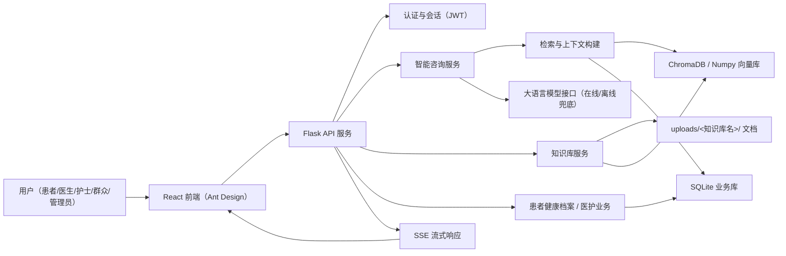

### 目录结构

```text
medical_assistant-master/
├── backend/
│   ├── api/            # Flask 蓝图：auth/kb/chat/dashboard/patient/doctor/nurse/schedule/admin
│   ├── services/       # 业务服务：咨询、知识库、检索、患者档案、医护、排班、用户管理
│   ├── models/         # schema.sql、SQLite 数据访问层
│   ├── data/           # medical-assistant-master.db、uploads/<知识库名>/、chroma/
│   ├── app.py          # Flask 入口（自动播种演示数据）
│   ├── seed.py         # 幂等数据播种（5 角色 + 12 知识库 + 每表 ≥50 条）
│   └── requirements.txt
├── frontend/
│   ├── src/layouts/    # MainLayout：5 角色导航、底部版权
│   ├── src/pages/      # 各角色页面
│   ├── src/api/        # Axios 封装与端点
│   └── src/types/      # 角色与业务类型
├── docs/images/        # 运行截图
├── scripts/            # 截图脚本等工具
├── docker-compose.yml
└── README.md
```

## 用户角色与权限

| 功能 | 患者 | 医生 | 护士 | 群众 | 管理员 |
| --- | :-: | :-: | :-: | :-: | :-: |
| 数据仪表盘 / 智能咨询 / 咨询历史 | ✅ | ✅ | ✅ | ✅ | ✅ |
| 全系统数据看板 | ❌ | ✅ | ❌ | ❌ | ✅ |
| 健康档案（住院/消费/挂号） | ✅（本人） | 管理侧 | 护理侧 | 挂号 | 代查 |
| 预约挂号 | ✅ | ✅（排班侧） | ❌ | ✅ | — |
| 患者管理 / 住院信息管理 | ❌ | ✅ | 协助 | ❌ | ✅ |
| 护理记录 / 排班 | ❌ | 排班 | ✅ | ❌ | ✅ |
| 知识库创建 / 上传 | ❌ | ✅ | ❌ | ❌ | ✅ |
| 系统用户管理 | ❌ | ❌ | ❌ | ❌ | ✅ |

## 12 个疾病知识库

系统预置以下公开知识库，文档存放于 `backend/data/uploads/<知识库名>/` 下：

| 知识库 | 科普文档（节选） |
| --- | --- |
| 呼吸系统疾病 | 感冒与流感、支气管哮喘、慢阻肺、社区获得性肺炎 |
| 心血管疾病 | 高血压、冠心病、心力衰竭、心律失常 |
| 消化系统疾病 | 慢性胃炎、消化性溃疡、脂肪肝、肠易激综合征 |
| 神经系统疾病 | 脑卒中、偏头痛、癫痫、帕金森病 |
| 内分泌代谢疾病 | 糖尿病、甲亢、痛风、骨质疏松 |
| 泌尿肾脏疾病 | 肾结石、尿路感染、慢性肾脏病、前列腺增生 |
| 风湿免疫疾病 | 类风湿关节炎、系统性红斑狼疮、骨关节炎、干燥综合征 |
| 感染性疾病 | 流感、乙型肝炎、肺结核、手足口病 |
| 急诊急症 | 急性胸痛、急性腹痛、中暑、创伤止血、急性中毒 |
| 外科骨科疾病 | 骨折、急性阑尾炎、胆囊结石、腰椎间盘突出症 |
| 皮肤科疾病 | 湿疹、荨麻疹、痤疮、带状疱疹 |
| 妇儿疾病 | 小儿肺炎、妊娠期糖尿病、产后护理、儿童发热、婴幼儿腹泻 |

## 数据库设计

数据库文件为 `backend/data/medical-assistant-master.db`（SQLite），由 `backend/models/schema.sql` 建表。播种脚本（`python seed.py`）幂等预置 **每个表 ≥50 条**演示数据。

| 表 | 说明 | 预置行数 |
| --- | --- | --- |
| users | 用户（5 种角色） | 50 |
| knowledge_bases | 知识库（12 疾病公开库 + 医生私有库） | 50 |
| documents | 文档（含向量切片数） | 50 |
| conversations | 咨询会话 | 50 |
| messages | 会话消息（问答对） | 100 |
| citations | 回答引用来源 | 50 |
| hospitalizations | 住院信息 | 50 |
| bills | 消费明细 | 50 |
| appointments | 预约挂号 | 50 |
| nursing_records | 护理记录 | 50 |
| schedules | 医护排班 | 50 |

## 运行截图

> 截图由 `scripts/screenshot.mjs`（puppeteer-core + 本机 Chrome）自动生成。

| | |
| --- | --- |
|  | 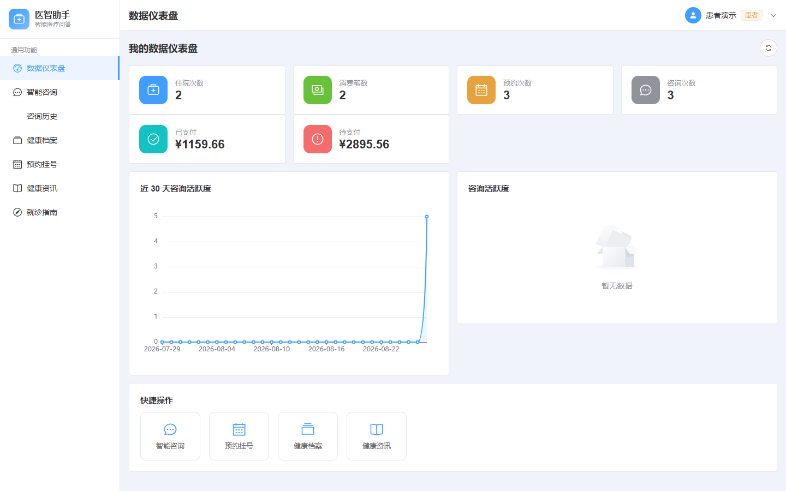 |
|  | 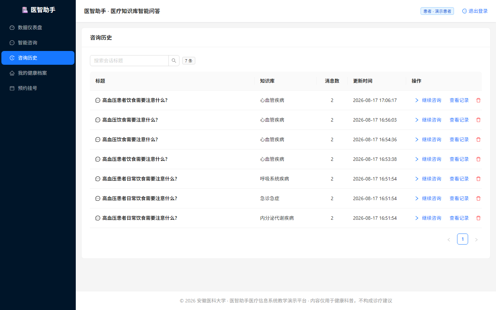 |
| 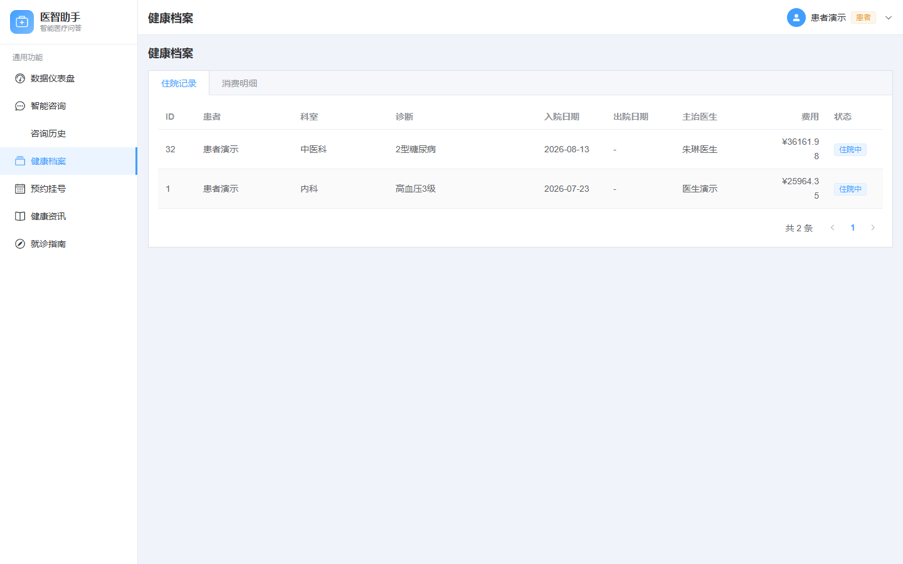 | 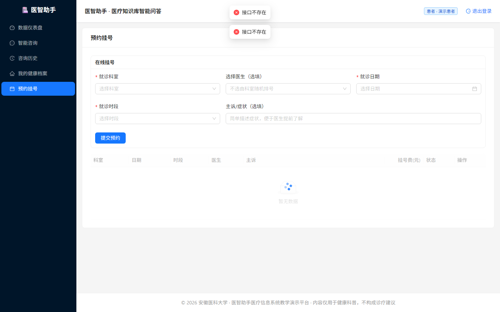 |
| 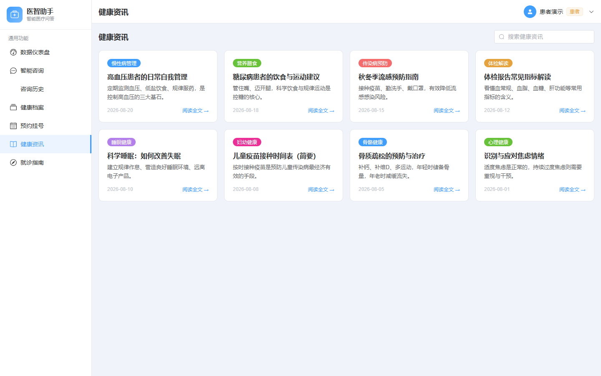 | 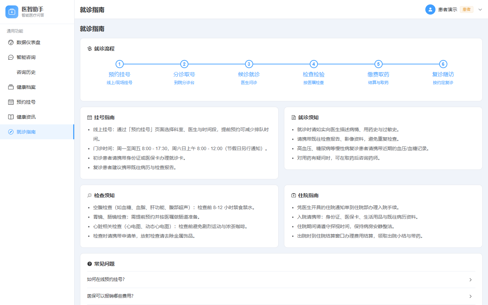 |
| 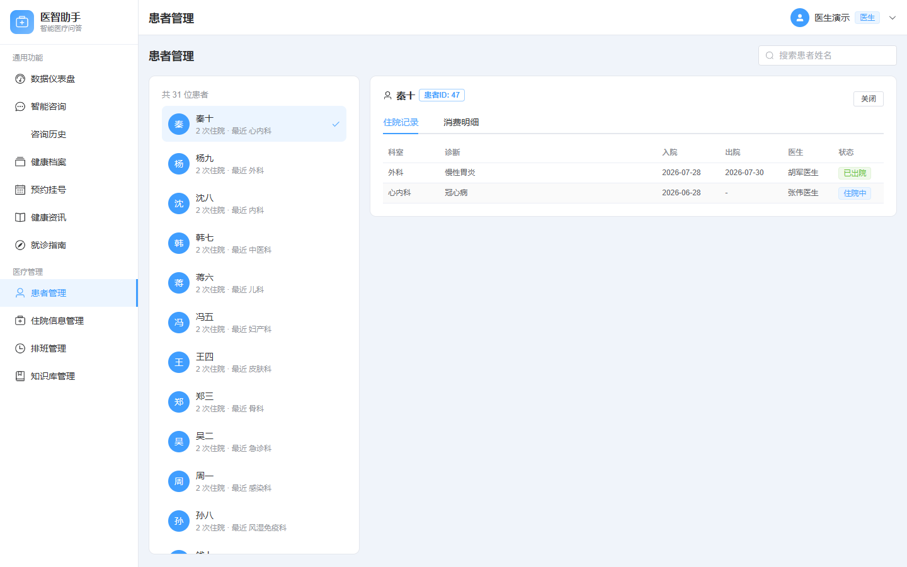 |  |
| 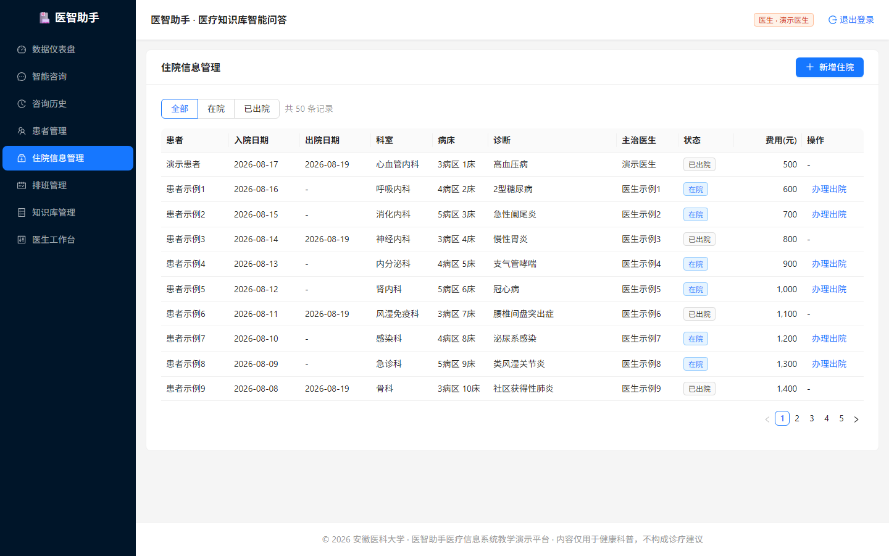 | 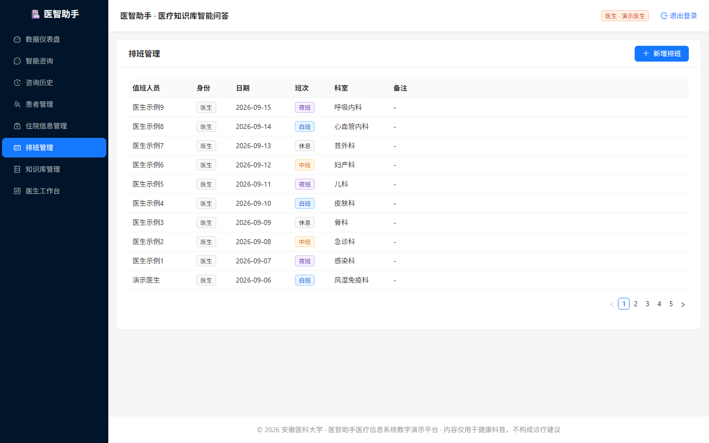 |
|  |  |
| 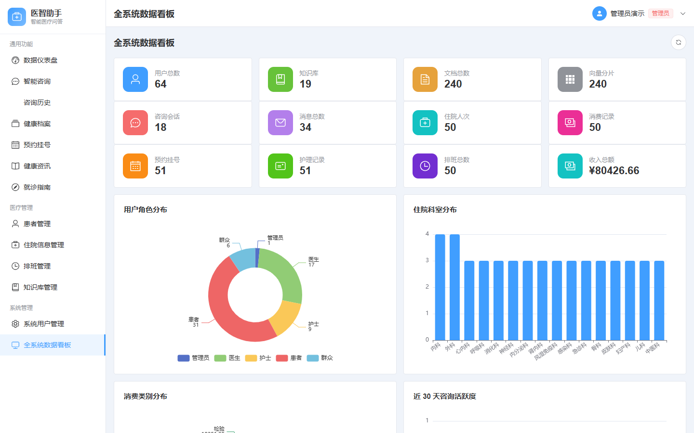 | |

## 快速开始

### Docker 部署

```bash
docker compose up --build
```

- 前端：http://localhost:3000
- 后端：http://localhost:8010
- 首次启动自动初始化演示数据，持久化在 `medical_data` 卷中。

### 本地运行

后端（Python 3.11+）：

```bash
cd backend
python -m venv .venv
# Windows: .venv\Scripts\pip install -r requirements.txt
.venv/bin/pip install -r requirements.txt
.venv/bin/python seed.py        # 初始化演示数据（每表 ≥50 条）
.venv/bin/python app.py         # http://127.0.0.1:8010
```

前端（Node 18+）：

```bash
cd frontend
npm install
npm run dev                     # http://localhost:5173，/api 自动代理到 8010
```

### 演示账号（密码均为 `demo123`）

| 账号 | 身份 |
| --- | --- |
| patientdemo | 患者 |
| doctordemo | 医生 |
| nursedemo | 护士 |
| publicdemo | 群众 |
| admindemo | 管理员 |

## 模型配置

后端通过 `backend/` 或项目根目录下的 `.env` 加载配置（`python-dotenv`，不覆盖已存在的环境变量）：

- **聊天**：填写 OpenAI 兼容接口即可在线问答（DeepSeek / OpenAI / 通义千问 / Ollama 均可）；
- **向量化**：默认使用内置确定性哈希向量（离线可用、无需下载模型，维度 `EMBED_DIM`）；如需真实语义向量，可设置 `OPENAI_EMBED_MODEL=all-MiniLM-L6-v2` 等本地模型并将 `EMBED_DIM` 调整为 384。
- **兜底**：未配置密钥或大模型调用失败时，系统自动降级为基于知识库检索的离线合成回答，全链路始终可用。

```bash
# backend/.env 或项目根 .env
OPENAI_BASE_URL=https://api.deepseek.com/v1
OPENAI_API_KEY=sk-xxx
OPENAI_CHAT_MODEL=deepseek-chat
OPENAI_EMBED_MODEL=          # 留空使用内置哈希向量
EMBED_DIM=256
```

## 开源注意事项

- 请勿提交真实账号、数据库密码、API Key 等敏感配置（`.env` 已在 `.gitignore` 中）。
- 项目回答仅用于医疗健康信息辅助理解，不构成诊断、处方或治疗建议；实际医疗问题应咨询专业医生。
