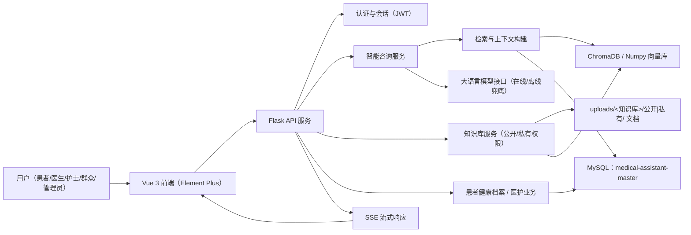

# 医智助手 · 医疗知识库智能问答系统

> **医智助手** 是面向医院信息系统教学场景（安医大医疗系统用户角色划分）的医学知识库智能问答平台。系统内置 **12 个疾病知识库（公开 120 篇 + 私有 120 篇文档）**、5 种角色门户，基于 **RAG（检索增强生成）** 为用户提供可追溯的医学知识问答服务，并为患者、医护与管理人员提供住院信息、消费明细、预约挂号、护理记录、排班、用户管理等业务功能。

## 项目背景

医疗信息化是医院管理与患者服务的核心支撑。本系统以"医学知识库 + 智能问答"为切入点，参考医院信息系统（HIS）的实际用户角色划分，构建了一个包含 **患者、医生、护士、群众、管理员** 五种角色的医疗辅助平台：

- **群众 / 患者**：只能基于 **公开知识库 + 公开文档** 进行智能咨询，浏览健康资讯、在线预约挂号、查询本人住院与消费信息；
- **医生**：可创建/管理知识库、上传文档（区分公开/私有），管理患者与住院信息、维护排班；
- **护士**：查看患者信息、记录护理记录、查看排班，查询时仅使用公开知识库与公开文档；
- **管理员**：管理系统用户、全部知识库与全系统数据看板。

系统通过本地知识库、向量检索与大语言模型能力，将医学资料转化为可检索、可追溯的问答服务，同时提供贴近医院实际业务的健康档案数据，适合作为数据库课程设计、软件工程教学演示或医疗科普平台。

## 核心功能

- **12 个疾病知识库**：呼吸系统、心血管、消化系统、神经系统、内分泌代谢、泌尿肾脏、风湿免疫、感染性疾病、急诊急症、外科骨科、皮肤科、妇儿疾病。每个知识库包含 **`公开/` 与 `私有/` 两个文件夹**，各 10 篇医学文档（共 240 篇）。
- **公开 / 私有权限模型**：知识库与文档均可设置为公开或私有。**患者、群众、护士** 查询时只能使用「公开知识库 + 公开文档」；**医生 / 管理员** 可查看并检索私有文档。
- **智能医疗咨询（RAG）**：自然语言提问 → 知识库召回（按角色过滤可见文档）→ 上下文构建 → 大模型流式回答，前端流式输出并附引用来源。
- **多角色门户**：5 种角色登录后呈现不同的功能导航与权限，全部界面统一在一个单页应用（Vue）中。
- **患者健康档案**：最近住院信息、消费明细、预约挂号查询。
- **医护工作台**：患者管理、住院信息管理、护理记录、排班管理。
- **系统管理**：用户增删改查、全系统统计看板。
- **知识库管理**：创建知识库、上传资料（txt/md/pdf/docx/pptx，可选公开/私有）、文档切分、向量化入库与检索，上传失败时返回具体原因。

## 技术栈

| 层级 | 技术 |
| --- | --- |
| 前端 | **Vue 3**、TypeScript、Vite、**Element Plus**、Vue Router、Pinia、ECharts、Axios（单页应用） |
| 后端 | Python、Flask、Flask-CORS（SSE 流式）、Blueprint + Service 分层 |
| 数据存储 | **MySQL 8**（数据库 `medical-assistant-master`，自动建库建表）、本地文件存储、ChromaDB / NumpyStore 向量库 |
| AI/RAG | OpenAI 兼容接口（DeepSeek 等）、文档切分、向量检索、关键词重排、上下文构建、SSE 流式响应、内置哈希向量兜底 |
| 部署 | Docker Compose（MySQL + 前端 Nginx + 后端 gunicorn） |

## 系统架构



### 目录结构

```text
medical_assistant-master/
├── backend/
│   ├── api/            # Flask 蓝图：auth/kb/chat/dashboard/patient/doctor/nurse/schedule/admin
│   ├── services/       # 业务服务：咨询、知识库、检索、患者档案、医护、排班、用户管理
│   ├── models/         # schema.sql（SQLite 兜底）、schema_mysql.sql（MySQL 建表）、db.py 数据访问层
│   ├── data/
│   │   ├── kb_docs_src/          # 知识库文档源：<知识库>/公开/ 与 <知识库>/私有/
│   │   ├── uploads/<知识库>/公开|私有/   # 落盘的文档目录
│   │   └── chroma/               # 向量库（NumpyStore / ChromaDB）
│   ├── app.py          # Flask 入口（自动建库建表 + 播种演示数据）
│   ├── seed.py         # 幂等数据播种（5 角色 + 12 知识库 + 每表 ≥50 条）
│   └── requirements.txt
├── frontend/           # Vue 3 + Element Plus 单页应用
│   ├── src/layouts/    # MainLayout：5 角色导航、底部版权
│   ├── src/pages/      # 各角色页面
│   ├── src/api/        # Axios 封装与端点
│   └── src/types/      # 角色与业务类型
├── docs/images/        # 运行截图
├── scripts/            # 截图脚本等工具
├── docker-compose.yml  # MySQL + 后端 + 前端
└── README.md
```

## 用户角色与权限

| 功能 | 患者 | 医生 | 护士 | 群众 | 管理员 |
| --- | :-: | :-: | :-: | :-: | :-: |
| 数据仪表盘 / 智能咨询 / 咨询历史 | ✅ | ✅ | ✅ | ✅ | ✅ |
| 全系统数据看板 | ❌ | ✅ | ❌ | ❌ | ✅ |
| 健康档案（住院/消费/挂号） | ✅（本人） | 管理侧 | 护理侧 | 挂号 | 代查 |
| 预约挂号 | ✅ | ✅（排班侧） | ❌ | ✅ | — |
| 患者管理 / 住院信息管理 | ❌ | ✅ | 协助 | ❌ | ✅ |
| 护理记录 / 排班 | ❌ | 排班 | ✅ | ❌ | ✅ |
| **创建知识库** | ❌ | ✅ | ❌ | ❌ | ✅ |
| **上传文档（公开知识库）** | ❌ | ✅ | ❌ | ❌ | ✅ |
| **上传文档（私有知识库）** | ❌ | 仅本人 | ❌ | ❌ | ✅ |
| **查询公开知识库 + 公开文档** | ✅ | ✅ | ✅ | ✅ | ✅ |
| **查询/检索私有文档** | ❌ | ✅ | ❌ | ❌ | ✅ |
| 系统用户管理 | ❌ | ❌ | ❌ | ❌ | ✅ |

## 12 个疾病知识库（公开 / 私有 文档）

知识库文档存放于 `backend/data/uploads/<知识库名>/公开/` 与 `.../私有/` 下，每个文件夹 10 篇医学文档（内容参考 `uploads/感冒与流感.md` 的格式撰写）：

| 知识库 | 公开文档（节选） | 私有文档（节选） |
| --- | --- | --- |
| 呼吸系统疾病 | 感冒与流感、支气管哮喘、慢阻肺、肺炎、肺癌早期筛查… | 慢性咳嗽鉴别、无创呼吸机规范、肺功能判读… |
| 心血管疾病 | 高血压、冠心病、心衰、心律失常、血脂异常… | 降压药物联合、房颤抗凝、心脏康复处方… |
| 消化系统疾病 | 慢性胃炎、消化性溃疡、脂肪肝、肠易激综合征… | 幽门螺杆菌根除、上消化道出血、内镜护理… |
| 神经系统疾病 | 脑卒中、偏头痛、癫痫、帕金森病、阿尔茨海默病… | 静脉溶栓、癫痫持续状态、神经重症监护… |
| 内分泌代谢疾病 | 糖尿病、甲亢、痛风、骨质疏松、甲状腺结节… | 降糖方案、胰岛素调整、甲状腺危象处理… |
| 泌尿肾脏疾病 | 肾结石、尿路感染、慢性肾脏病、前列腺增生… | 血尿鉴别、透析管理、PSA 解读… |
| 风湿免疫疾病 | 类风湿关节炎、系统性红斑狼疮、骨关节炎… | 自身抗体解读、生物制剂规范、免疫抑制剂监测… |
| 感染性疾病 | 流感、乙肝、肺结核、手足口病、水痘… | 抗菌药物合理使用、脓毒症识别、院感防控… |
| 急诊急症 | 急性胸痛、急性腹痛、中暑、创伤止血、心肺复苏… | 急诊分诊、多发伤急救、绿色通道… |
| 外科骨科疾病 | 骨折、急性阑尾炎、胆囊结石、腰椎间盘突出… | 围手术期管理、术后疼痛、深静脉血栓预防… |
| 皮肤科疾病 | 湿疹、荨麻疹、痤疮、带状疱疹、银屑病… | 糖皮质激素分级使用、重症药疹、光疗… |
| 妇儿疾病 | 小儿肺炎、妊娠期糖尿病、产后护理、儿童发热… | 妊娠期高血压管理、新生儿黄疸评估… |

## 数据库设计

系统使用 **MySQL 8**，数据库名为 **`medical-assistant-master`**，由后端启动时（`python backend/app.py`）自动创建：

- 若数据库不存在，自动执行 `CREATE DATABASE IF NOT EXISTS \`medical-assistant-master\`...`；
- 自动执行 `backend/models/schema_mysql.sql` 中的建表语句（幂等，可重复执行）；
- 自动播种演示数据（5 种角色演示账号、12 个疾病知识库 240 篇文档、每表 ≥50 条业务数据）。

> 如本机没有 MySQL，可设置 `DB_TYPE=sqlite` 回退到本地 SQLite（`backend/data/medical-assistant-master.db`），建表 SQL 见 `backend/models/schema.sql`。

### 建库语句

```sql
CREATE DATABASE IF NOT EXISTS `medical-assistant-master`
  DEFAULT CHARACTER SET utf8mb4 COLLATE utf8mb4_unicode_ci;
```

### 数据表一览

| 表名 | 说明 | 预置行数 |
| --- | --- | --- |
| users | 用户（5 种角色：patient/doctor/nurse/public/admin） | 50 |
| knowledge_bases | 知识库（12 疾病公开库 + 医生私有库，`visibility` 区分公开/私有） | 50 |
| documents | 文档（`visibility` 区分公开/私有，存于 uploads 下公开/私有目录） | 240 |
| conversations | 咨询会话 | 50 |
| messages | 会话消息（问答对） | 100 |
| citations | 回答引用来源 | 50 |
| hospitalizations | 住院信息 | 50 |
| bills | 消费明细 | 50 |
| appointments | 预约挂号 | 50 |
| nursing_records | 护理记录 | 50 |
| schedules | 医护排班 | 50 |

### 建表语句

```sql
-- 用户表
CREATE TABLE IF NOT EXISTS `users` (
  `id`            INT UNSIGNED NOT NULL AUTO_INCREMENT,
  `username`      VARCHAR(32)  NOT NULL COMMENT '登录用户名（唯一）',
  `password_hash` VARCHAR(255) NOT NULL COMMENT '密码哈希',
  `role`          VARCHAR(16)  NOT NULL COMMENT 'patient/doctor/nurse/public/admin',
  `display_name`  VARCHAR(64)  NULL,
  `created_at`    DATETIME     NOT NULL DEFAULT CURRENT_TIMESTAMP,
  PRIMARY KEY (`id`),
  UNIQUE KEY `uk_users_username` (`username`),
  KEY `idx_users_role` (`role`)
) ENGINE=InnoDB DEFAULT CHARSET=utf8mb4 COLLATE=utf8mb4_unicode_ci COMMENT='用户表';

-- 知识库表（visibility：public/private）
CREATE TABLE IF NOT EXISTS `knowledge_bases` (
  `id`          INT UNSIGNED NOT NULL AUTO_INCREMENT,
  `owner_id`    INT UNSIGNED NULL COMMENT 'NULL=平台公共知识库',
  `name`        VARCHAR(128) NOT NULL,
  `description` VARCHAR(512) NULL,
  `visibility`  VARCHAR(16)  NOT NULL DEFAULT 'private' COMMENT 'public/private',
  `created_at`  DATETIME     NOT NULL DEFAULT CURRENT_TIMESTAMP,
  PRIMARY KEY (`id`),
  KEY `idx_kb_owner` (`owner_id`),
  KEY `idx_kb_visibility` (`visibility`)
) ENGINE=InnoDB DEFAULT CHARSET=utf8mb4 COLLATE=utf8mb4_unicode_ci COMMENT='知识库表';

-- 文档表（visibility：public/private，存于 uploads/<知识库>/公开|私有/ 目录）
CREATE TABLE IF NOT EXISTS `documents` (
  `id`          INT UNSIGNED NOT NULL AUTO_INCREMENT,
  `kb_id`       INT UNSIGNED NOT NULL,
  `filename`    VARCHAR(255) NOT NULL,
  `file_path`   VARCHAR(512) NOT NULL COMMENT 'UPLOAD_DIR 下的相对路径',
  `file_type`   VARCHAR(16)  NOT NULL COMMENT 'txt/md/pdf/docx/pptx',
  `visibility`  VARCHAR(16)  NOT NULL DEFAULT 'public' COMMENT 'public/private',
  `chunk_count` INT          NOT NULL DEFAULT 0,
  `status`      VARCHAR(16)  NOT NULL DEFAULT 'processing' COMMENT 'processing/ready/failed',
  `error`       VARCHAR(512) NULL,
  `created_at`  DATETIME     NOT NULL DEFAULT CURRENT_TIMESTAMP,
  PRIMARY KEY (`id`),
  KEY `idx_doc_kb` (`kb_id`),
  KEY `idx_doc_visibility` (`visibility`)
) ENGINE=InnoDB DEFAULT CHARSET=utf8mb4 COLLATE=utf8mb4_unicode_ci COMMENT='知识库文档表';

-- 咨询会话表
CREATE TABLE IF NOT EXISTS `conversations` (
  `id`          VARCHAR(32)  NOT NULL COMMENT 'uuid4 hex',
  `user_id`     INT UNSIGNED NOT NULL,
  `kb_id`       INT UNSIGNED NULL,
  `title`       VARCHAR(128) NOT NULL,
  `created_at`  DATETIME     NOT NULL DEFAULT CURRENT_TIMESTAMP,
  `updated_at`  DATETIME     NOT NULL DEFAULT CURRENT_TIMESTAMP,
  PRIMARY KEY (`id`),
  KEY `idx_conv_user` (`user_id`),
  KEY `idx_conv_kb` (`kb_id`)
) ENGINE=InnoDB DEFAULT CHARSET=utf8mb4 COLLATE=utf8mb4_unicode_ci COMMENT='咨询会话表';

-- 会话消息表
CREATE TABLE IF NOT EXISTS `messages` (
  `id`              INT UNSIGNED NOT NULL AUTO_INCREMENT,
  `conversation_id` VARCHAR(32)  NOT NULL,
  `role`            VARCHAR(16)  NOT NULL COMMENT 'user/assistant',
  `content`         TEXT         NOT NULL,
  `created_at`      DATETIME     NOT NULL DEFAULT CURRENT_TIMESTAMP,
  PRIMARY KEY (`id`),
  KEY `idx_messages_conv` (`conversation_id`)
) ENGINE=InnoDB DEFAULT CHARSET=utf8mb4 COLLATE=utf8mb4_unicode_ci COMMENT='会话消息表';

-- 引用来源表
CREATE TABLE IF NOT EXISTS `citations` (
  `id`           INT UNSIGNED NOT NULL AUTO_INCREMENT,
  `message_id`   INT UNSIGNED NOT NULL,
  `document_id`  INT UNSIGNED NOT NULL,
  `chunk_index`  INT          NOT NULL,
  `source_text`  TEXT         NULL,
  `title`        VARCHAR(255) NULL,
  `similarity`   DOUBLE       NULL,
  PRIMARY KEY (`id`),
  KEY `idx_citations_msg` (`message_id`)
) ENGINE=InnoDB DEFAULT CHARSET=utf8mb4 COLLATE=utf8mb4_unicode_ci COMMENT='回答引用来源表';

-- 住院信息表
CREATE TABLE IF NOT EXISTS `hospitalizations` (
  `id`             INT UNSIGNED NOT NULL AUTO_INCREMENT,
  `patient_id`     INT UNSIGNED NOT NULL,
  `admit_date`     VARCHAR(20)  NOT NULL,
  `discharge_date` VARCHAR(20)  NULL,
  `department`     VARCHAR(64)  NOT NULL,
  `ward`           VARCHAR(64)  NULL,
  `bed_no`         VARCHAR(32)  NULL,
  `diagnosis`      VARCHAR(255) NULL,
  `doctor_id`      INT UNSIGNED NULL,
  `status`         VARCHAR(16)  NOT NULL DEFAULT 'in_hospital' COMMENT 'in_hospital/discharged',
  `total_cost`     DOUBLE       NOT NULL DEFAULT 0,
  `created_at`     DATETIME     NOT NULL DEFAULT CURRENT_TIMESTAMP,
  PRIMARY KEY (`id`),
  KEY `idx_hosp_patient` (`patient_id`)
) ENGINE=InnoDB DEFAULT CHARSET=utf8mb4 COLLATE=utf8mb4_unicode_ci COMMENT='住院信息表';

-- 消费明细表
CREATE TABLE IF NOT EXISTS `bills` (
  `id`          INT UNSIGNED NOT NULL AUTO_INCREMENT,
  `patient_id`  INT UNSIGNED NOT NULL,
  `bill_no`     VARCHAR(64)  NOT NULL,
  `category`    VARCHAR(32)  NOT NULL COMMENT '挂号/检查/检验/药品/住院/门诊',
  `description` VARCHAR(255) NULL,
  `amount`      DOUBLE       NOT NULL DEFAULT 0,
  `status`      VARCHAR(16)  NOT NULL DEFAULT 'unpaid' COMMENT 'paid/unpaid',
  `created_at`  DATETIME     NOT NULL DEFAULT CURRENT_TIMESTAMP,
  PRIMARY KEY (`id`),
  UNIQUE KEY `uk_bills_bill_no` (`bill_no`),
  KEY `idx_bills_patient` (`patient_id`)
) ENGINE=InnoDB DEFAULT CHARSET=utf8mb4 COLLATE=utf8mb4_unicode_ci COMMENT='消费明细表';

-- 门诊预约挂号表
CREATE TABLE IF NOT EXISTS `appointments` (
  `id`         INT UNSIGNED NOT NULL AUTO_INCREMENT,
  `patient_id` INT UNSIGNED NOT NULL,
  `doctor_id`  INT UNSIGNED NULL,
  `department` VARCHAR(64)  NOT NULL,
  `date`       VARCHAR(20)  NOT NULL,
  `time_slot`  VARCHAR(32)  NOT NULL,
  `symptom`    VARCHAR(255) NULL,
  `fee`        DOUBLE       NOT NULL DEFAULT 0,
  `status`     VARCHAR(16)  NOT NULL DEFAULT 'booked' COMMENT 'booked/confirmed/visited/cancelled',
  `created_at` DATETIME     NOT NULL DEFAULT CURRENT_TIMESTAMP,
  PRIMARY KEY (`id`),
  KEY `idx_appt_patient` (`patient_id`)
) ENGINE=InnoDB DEFAULT CHARSET=utf8mb4 COLLATE=utf8mb4_unicode_ci COMMENT='门诊预约挂号表';

-- 护理记录表
CREATE TABLE IF NOT EXISTS `nursing_records` (
  `id`          INT UNSIGNED NOT NULL AUTO_INCREMENT,
  `patient_id`  INT UNSIGNED NOT NULL,
  `nurse_id`    INT UNSIGNED NOT NULL,
  `record_type` VARCHAR(16)  NOT NULL DEFAULT 'daily' COMMENT 'daily/medication/vitals/other',
  `content`     TEXT         NOT NULL,
  `recorded_at` DATETIME     NOT NULL DEFAULT CURRENT_TIMESTAMP,
  PRIMARY KEY (`id`),
  KEY `idx_nursing_patient` (`patient_id`)
) ENGINE=InnoDB DEFAULT CHARSET=utf8mb4 COLLATE=utf8mb4_unicode_ci COMMENT='护理记录表';

-- 医护排班表
CREATE TABLE IF NOT EXISTS `schedules` (
  `id`         INT UNSIGNED NOT NULL AUTO_INCREMENT,
  `staff_id`   INT UNSIGNED NOT NULL,
  `work_date`  VARCHAR(20)  NOT NULL,
  `shift`      VARCHAR(16)  NOT NULL COMMENT 'day/night/evening/off',
  `department` VARCHAR(64)  NULL,
  `remark`     VARCHAR(255) NULL,
  `status`     VARCHAR(16)  NOT NULL DEFAULT 'on_duty' COMMENT 'on_duty/off/leave',
  `created_at` DATETIME     NOT NULL DEFAULT CURRENT_TIMESTAMP,
  PRIMARY KEY (`id`),
  KEY `idx_schedule_staff` (`staff_id`)
) ENGINE=InnoDB DEFAULT CHARSET=utf8mb4 COLLATE=utf8mb4_unicode_ci COMMENT='医护排班表';
```

## 运行截图

> 截图由 `scripts/screenshot.mjs`（puppeteer-core + 本机 Chrome）自动生成。

| | |
| --- | --- |
|  |  |
|  |  |
|  |  |
|  |  |
|  |  |
|  |  |
|  |  |
|  | |

## 快速开始

### 1. 准备 MySQL

安装并启动 MySQL 8（本机默认 `root / 123456`，可通过 `backend/.env` 或项目根 `.env` 修改）：

```bash
mysql -u root -p
```

### 2. 后端（Python 3.11+）

```bash
cd backend
python -m venv .venv
# Windows: .venv\Scripts\pip install -r requirements.txt
.venv/bin/pip install -r requirements.txt
.venv/bin/python app.py          # 自动建库建表 + 播种演示数据，http://127.0.0.1:8010
```

首次启动会自动创建数据库 `medical-assistant-master`、全部数据表并播种演示数据；如需手动重置：

```bash
.venv/bin/python seed.py
```

> 若本机没有 MySQL，可在 `.env` 中设置 `DB_TYPE=sqlite` 回退到本地 SQLite。

### 3. 前端（Node 18+）

```bash
cd frontend
npm install
npm run dev                       # http://localhost:5173，/api 自动代理到 8010
```

生产构建：

```bash
npm run build                     # 产物在 frontend/dist/
```

### Docker 部署

```bash
docker compose up --build
```

- 前端：http://localhost:3000
- 后端：http://localhost:8010
- MySQL：127.0.0.1:3306（数据持久化于 `mysql_data` 卷）

### 演示账号（密码均为 `demo123`）

| 账号 | 身份 | 权限特点 |
| --- | --- | --- |
| patientdemo | 患者 | 仅查询公开知识库/公开文档，可查本人健康档案、预约挂号 |
| doctordemo | 医生 | 可创建/管理知识库、上传公开/私有文档、查看私有文档 |
| nursedemo | 护士 | 护理工作台，查询仅限公开知识库/公开文档 |
| publicdemo | 群众 | 仅查询公开知识库/公开文档，健康资讯、就诊指南、预约挂号 |
| admindemo | 管理员 | 系统管理、全部知识库与文档、全系统看板 |

## 模型配置

后端通过 `backend/` 或项目根目录下的 `.env` 加载配置（`python-dotenv`，不覆盖已存在的环境变量）：

- **聊天**：填写 OpenAI 兼容接口即可在线问答（DeepSeek / OpenAI / 通义千问 / Ollama 均可）；
- **向量化**：默认使用内置确定性哈希向量（离线可用、无需下载模型，维度 `EMBED_DIM`）；如需真实语义向量，可设置 `OPENAI_EMBED_MODEL=all-MiniLM-L6-v2` 等本地模型并将 `EMBED_DIM` 调整为 384。
- **兜底**：未配置密钥或大模型调用失败时，系统自动降级为基于知识库检索的离线合成回答，全链路始终可用。

```bash
# backend/.env 或项目根 .env
DB_TYPE=mysql
DATABASE_NAME=medical-assistant-master
MYSQL_HOST=127.0.0.1
MYSQL_PORT=3306
MYSQL_USER=root
MYSQL_PASSWORD=123456
OPENAI_BASE_URL=https://api.deepseek.com/v1
OPENAI_API_KEY=sk-xxx
OPENAI_CHAT_MODEL=deepseek-chat
OPENAI_EMBED_MODEL=          # 留空使用内置哈希向量
EMBED_DIM=256
```

## 开源注意事项

- 请勿提交真实账号、数据库密码、API Key 等敏感配置（`.env` 已在 `.gitignore` 中）。
- 项目回答仅用于医疗健康信息辅助理解，不构成诊断、处方或治疗建议；实际医疗问题应咨询专业医生。
