# 医智助手 · 项目完整架构与流程图（从开始到结束）

> 本文把项目从 **需求分析 → 系统设计 → 环境准备 → 数据准备 → 后端开发 → 前端开发 → 部署 → 运行使用 → 测试验收 → 迭代改进** 的完整生命周期串起来，配合 Mermaid 图，让你能讲清楚"这个项目从头到尾是怎么做出来的"。旧版《项目架构图与流程图.md》保留，本文是它的完整生命周期加强版。
>
> 适用场景：面试时被问"你是怎么把这个项目做出来的""项目整体过程是什么""讲讲项目的数据流/开发流程"。

---

## 目录
- [第 1 阶段 项目生命周期总览](#第-1-阶段项目生命周期总览)
- [第 2 阶段 需求分析与角色定义](#第-2-阶段需求分析与角色定义)
- [第 3 阶段 系统设计](#第-3-阶段系统设计)
- [第 4 阶段 环境准备](#第-4-阶段环境准备)
- [第 5 阶段 数据准备（知识库 240 篇文档）](#第-5-阶段数据准备知识库-240-篇文档)
- [第 6 阶段 后端开发（RAG 全链路）](#第-6-阶段后端开发rag-全链路)
- [第 7 阶段 前端开发（Vue3 SPA）](#第-7-阶段前端开发vue3-spa)
- [第 8 阶段 部署与启动](#第-8-阶段部署与启动)
- [第 9 阶段 系统运行与使用流程（各角色）](#第-9-阶段系统运行与使用流程各角色)
- [第 10 阶段 测试与验收](#第-10-阶段测试与验收)
- [第 11 阶段 迭代与改进](#第-11-阶段迭代与改进)
- [第 12 阶段 数据全生命周期（一份文档的旅程）](#第-12-阶段数据全生命周期一份文档的旅程)
- [第 13 阶段 面试讲解闭环模板](#第-13-阶段面试讲解闭环模板)

---

## 第 1 阶段 项目生命周期总览

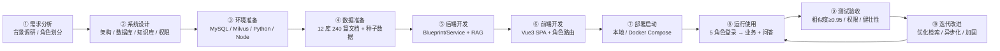

**一句话闭环**：从医疗信息化的需求出发，设计 5 种角色 + 12 个知识库，搭好技术栈，把 240 篇医学文档入库做向量化，开发出前端问答与医院业务功能，部署运行并通过"检索准确率、权限隔离、全链路可用"三类验收，再持续迭代优化。

---

## 第 2 阶段 需求分析与角色定义

### 2.1 需求来源
- 医疗信息化是医院管理与患者服务的核心支撑，参考 **HIS（医院信息系统）** 的实际角色划分（安医大医疗系统用户角色）。
- 需要把本地医学知识库转化为**可检索、可追溯**的智能问答，而不是依赖大模型的"编造"。

### 2.2 角色与权限需求

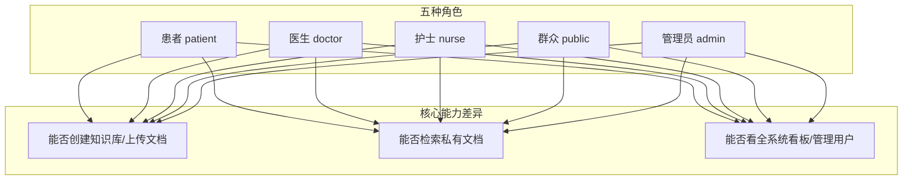

| 角色 | 定位 | 权限特点 |
| --- | --- | --- |
| 患者 | 本人健康信息 | 只能查公开库/公开文档，查本人住院/消费/挂号 |
| 医生 | 内容生产者 | 可创建知识库、上传公开/私有文档、检索私有、管理患者/住院/排班 |
| 护士 | 护理执行 | 护理记录/排班，检索仅公开 |
| 群众 | 公众科普 | 仅查公开、健康资讯、挂号 |
| 管理员 | 系统运维 | 用户管理、全部知识库、全系统看板 |

### 2.3 验收标准（从改进文档提炼）
1. 公开/私有权限模型正确（患者/群众/护士看不到私有）。
2. 上传失败能返回具体原因、可处理。
3. RAG 引用相似度 ≥ **0.95**。
4. 数据库自动建库建表，每表预置 ≥50 条数据。
5. 界面统一在单页（Vue），角色导航符合事实。

---

## 第 3 阶段 系统设计

### 3.1 总体架构

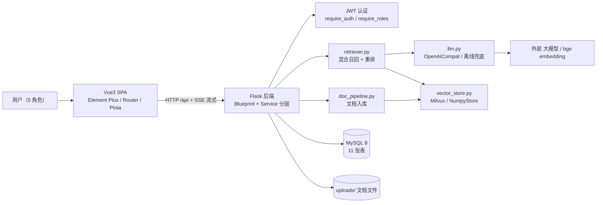

### 3.2 数据库设计（11 张表）
users / knowledge_bases / documents / conversations / messages / citations / hospitalizations / bills / appointments / nursing_records / schedules。

**核心关联（引用溯源链）：**
```text
conversations (会话)
   └─ messages (问答对: role=user/assistant)
        └─ citations (引用来源: document_id, chunk_index, similarity)
             └─ documents (文档: kb_id, file_path, visibility, chunk_count, status)
```

### 3.3 知识库设计
- 12 个疾病知识库，每个含 `公开/` 与 `私有/` 两个文件夹，各 10 篇（共 240 篇）。
- 库与文档都有 `visibility`（public/private）。

---

## 第 4 阶段 环境准备

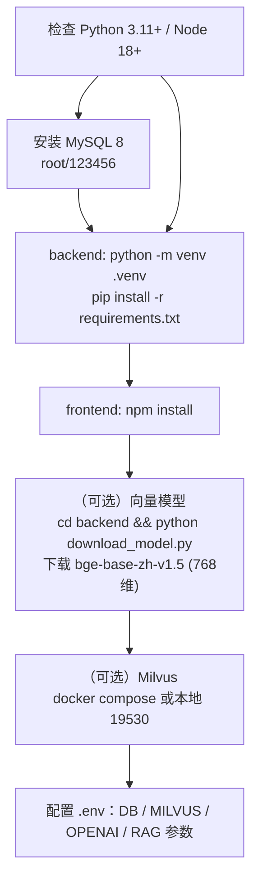

**关键配置（config.py 全部走环境变量）：**
```ini
DB_TYPE=mysql | sqlite
MYSQL_HOST/PORT/USER/PASSWORD
MILVUS_ENABLE=1  MILVUS_HOST=127.0.0.1  MILVUS_PORT=19530
OPENAI_BASE_URL=...  OPENAI_API_KEY=...  OPENAI_CHAT_MODEL=deepseek-chat
OPENAI_EMBED_MODEL=BAAI/bge-base-zh-v1.5
EMBED_DIM=768  CHUNK_SIZE=380  CHUNK_OVERLAP=60  TOP_K=6  MIN_SIMILARITY=0.30
```

---

## 第 5 阶段 数据准备（知识库 240 篇文档）

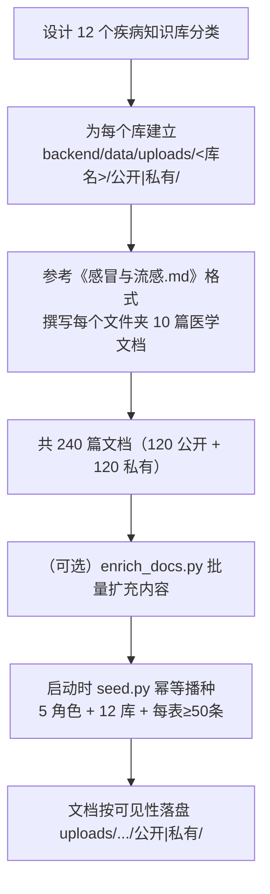

**说明**：这些文档既作为 `uploads/` 里的原始文件，也会在首次入库/播种时被**切分向量化**写入 Milvus/NumpyStore，供后续 RAG 检索。

---

## 第 6 阶段 后端开发（RAG 全链路）

### 6.1 代码组织（Blueprint + Service 分层）
```
app.py          Flask 入口：建库建表 + 首启播种
config.py       环境变量配置
extensions.py   进程内单例：向量库选择 + LLM 选择
api/            auth kb chat dashboard patient doctor nurse schedule admin + decorators
services/       retriever chat llm vector_store doc_pipeline kb_service auth/patient/doctor/nurse/schedule/admin
models/         db.py(数据访问) schema_mysql.sql schema.sql
utils/          text_utils(切分/关键词) file_utils(抽取) errors
```

### 6.2 RAG 问答核心流程

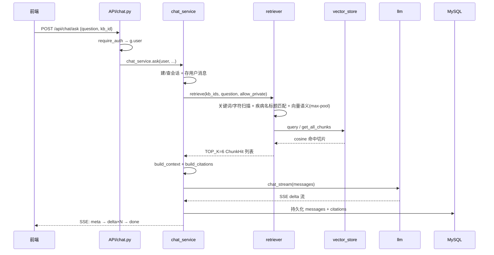

### 6.3 混合召回策略（retriever.py）——项目灵魂

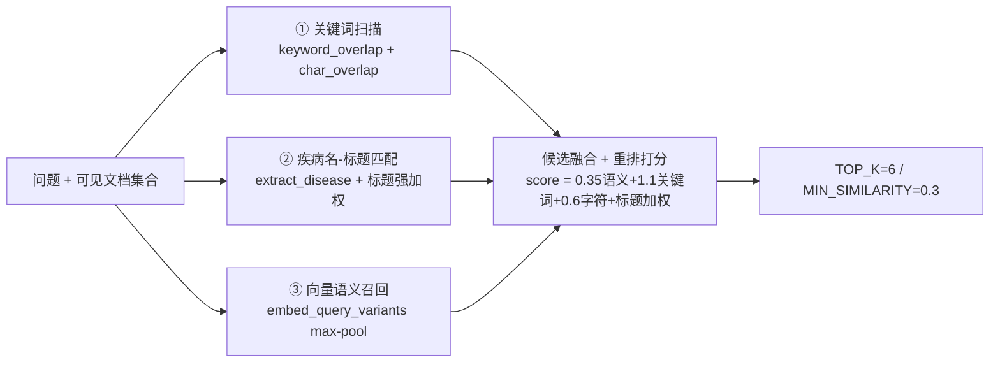

> 关键公式：标题命中时 `sim = 1-(1-sem)*(1-0.95)` 恒 ≥0.95，用确定性标题匹配兜住向量分低，满足验收。

### 6.4 文档入库流水线（doc_pipeline）
```text
extract_text(抽取) → chunk_text(递归切分) → llm.embed(向量化)
→ vector_store.upsert(入库) → 更新 documents.status='ready'
（失败 → status='failed' + 记录 error，前端展示并允许删除）
```

---

## 第 7 阶段 前端开发（Vue3 SPA）

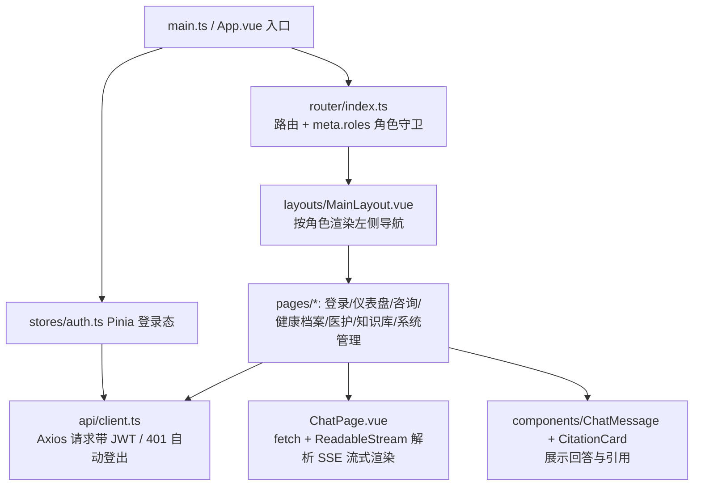

**前端要点**：
- 单页应用，5 角色共用一套代码，靠路由 `meta.roles` + 守卫区分权限（前端只是体验，后端才是安全边界）。
- 聊天用原生 `fetch` 读 `ReadableStream`，按 `\n\n` 分帧、`data:` 前缀解析 SSE 事件（meta/delta/done）。
- `client.ts` 拦截器：请求统一加 `Authorization: Bearer <token>`；响应 401 自动清 token 跳登录。

---

## 第 8 阶段 部署与启动

### 8.1 本地启动
```bash
# 后端
cd backend && python app.py        # 自动建库建表 + 播种，http://127.0.0.1:8010
# 前端
cd frontend && npm run dev          # http://localhost:5173，/api 代理到 8010
```

### 8.2 Docker Compose 部署

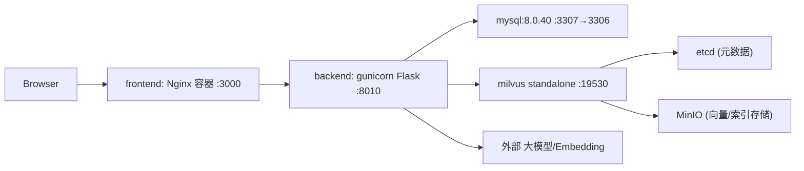

- 服务依赖：`depends_on condition: service_healthy`（MySQL/Milvus 健康后才启动 backend）。
- 数据持久化：`mysql_data / milvus_data / etcd_data / minio_data / medical_data` 卷。

### 8.3 启动时自动初始化（幂等）
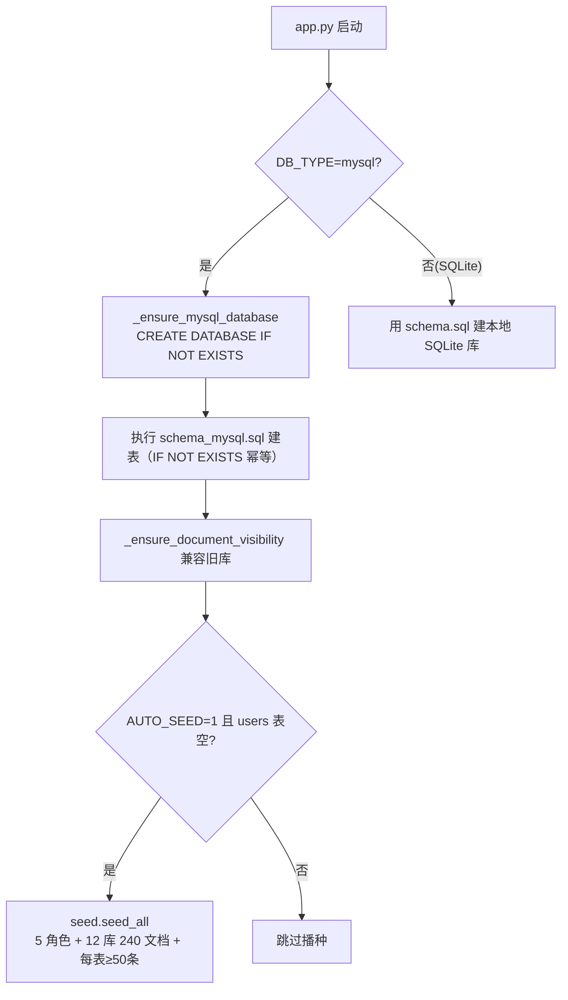

---

## 第 9 阶段 系统运行与使用流程（各角色）

### 9.1 通用登录流程
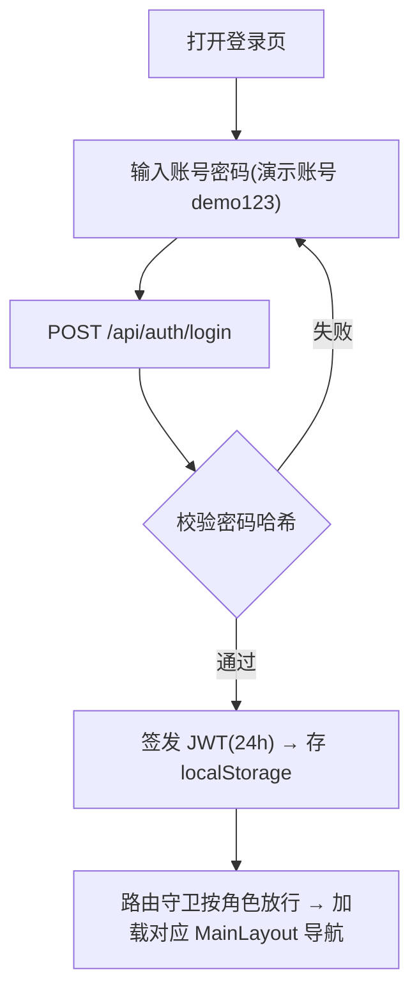

### 9.2 各角色典型操作
- **患者**：智能咨询（公开）→ 查本人住院/消费 → 预约挂号 → 咨询历史。
- **医生**：智能咨询（含私有）→ 知识库管理（建库/上传公开+私有）→ 患者/住院/排班管理。
- **护士**：护理工作台（护理记录/排班）→ 智能咨询（仅公开）。
- **群众**：智能咨询（公开）→ 健康资讯 → 就诊指南 → 预约挂号。
- **管理员**：全系统看板 → 用户管理 → 全部知识库/文档管理。

### 9.3 智能咨询完整使用链路（端到端）
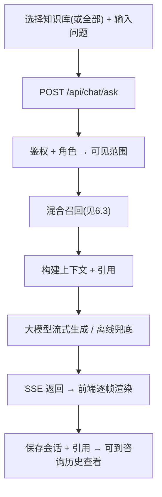

---

## 第 10 阶段 测试与验收

| 验收项 | 验证方式 | 预期 |
| --- | --- | --- |
| 检索准确度 | 提问如"高血压饮食注意什么" | 引用相似度 ≥ 0.95 |
| 选错库仍能答对 | 在非匹配库问跨库问题 | 自动跨全部可见库检索命中 |
| 同义词 | 问"发烧"命中"发热"文档 | 命中 |
| 权限隔离 | 患者问私有文档内容 | 不进入检索，答"资料未覆盖" |
| 上传失败可控 | 传损坏/不支持文件 | 返回 status=failed + error，可删除 |
| 健壮性 | 关掉 Milvus / 不配 key | 自动降级 NumpyStore / 离线回答 |
| 数据库 | 空环境启动 | 自动建库建表 + 播种 50+ 条 |

---

## 第 11 阶段 迭代与改进

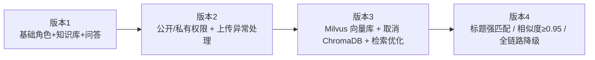

**当前可继续改进**（面试加分）：
- 文档入库异步化（任务队列），避免同步阻塞。
- 加 Rerank（bge-reranker）+ BM25 hybrid 检索。
- 多轮上下文、流式中止（AbortController）。
- 生产安全：换 JWT_SECRET、密钥只走环境变量、接口限流、防 prompt 注入。

---

## 第 12 阶段 数据全生命周期（一份文档的旅程）

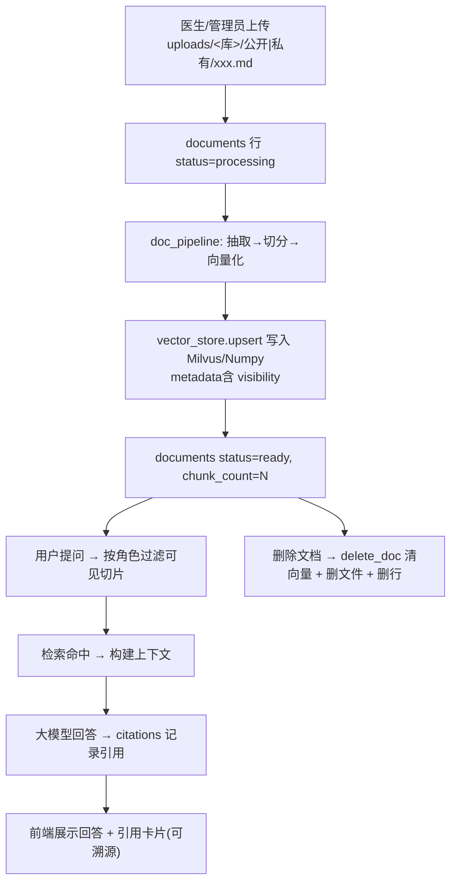

**这条链路能讲清"公开/私有如何在检索层生效"**：文档向量入库时带上 `visibility` 元数据，患者等角色检索时 `filter visibility='public'`，私有向量根本不会被检索到。

---

## 第 13 阶段 面试讲解闭环模板

> 当面试官问"讲讲你整个项目"时，按这个顺序讲（约 2~3 分钟）：

1. **背景**：面向医院信息系统教学场景，参考 HIS 角色划分，做一个医疗知识库智能问答平台。
2. **需求**：5 种角色 + 12 疾病知识库 + 公开/私有权限 + 可追溯问答 + 医院业务功能。
3. **技术栈**：Vue3 + Flask + MySQL + Milvus + RAG（OpenAI 兼容 + bge embedding）。
4. **设计**：Blueprint/Service 分层；11 张表；240 篇文档；Milvus 单集合 + kb_id 分区。
5. **开发**：先搭后端 RAG 链路（混合召回 + 流式），再做前端 SPA；数据自动播种。
6. **难点与解法**：选错库/向量分低 → 跨库检索 + 关键词/字符 + 疾病名标题强匹配（相似度≥0.95）；私有泄露 → 检索层 filter；不可用 → 全链路降级。
7. **验收**：检索准确率、权限隔离、健壮性、自动建库。
8. **可改进**：异步上传、Rerank、多轮上下文、安全加固。
