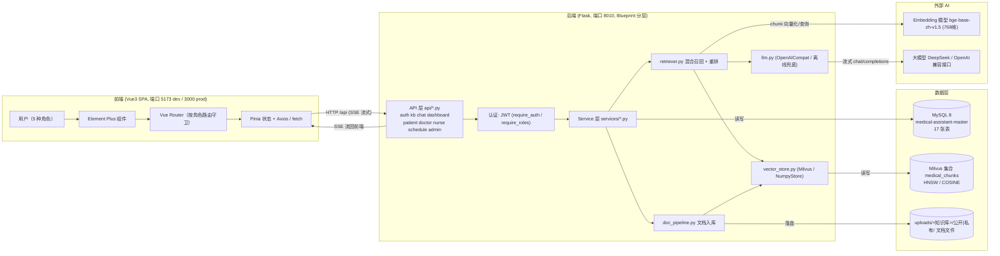
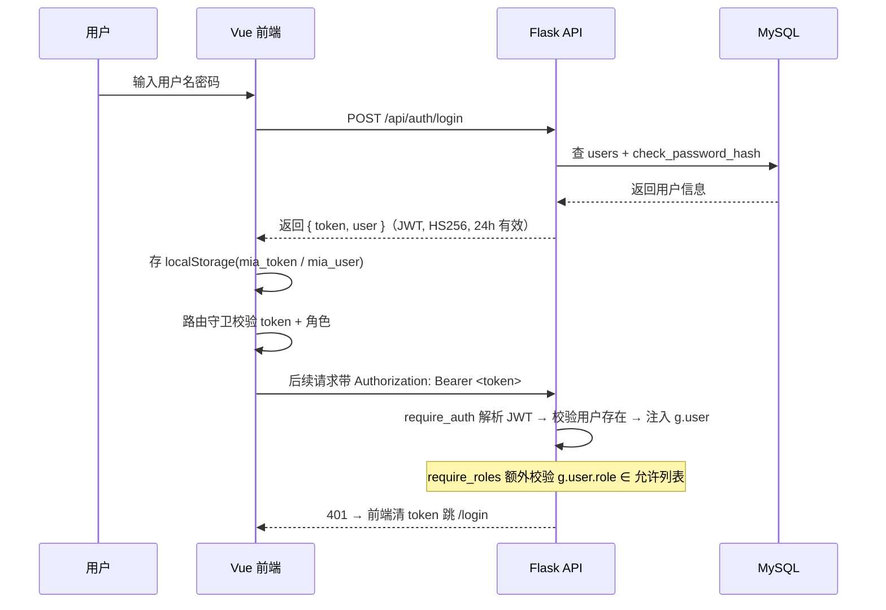
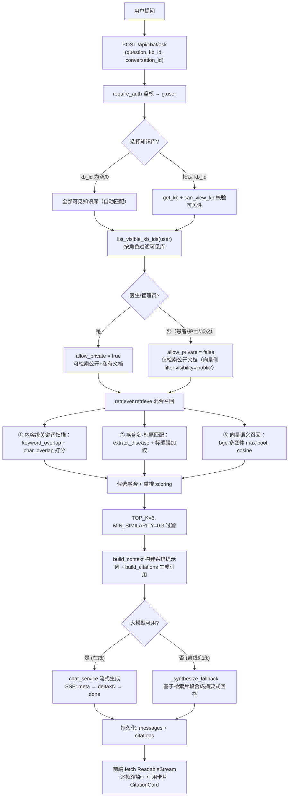
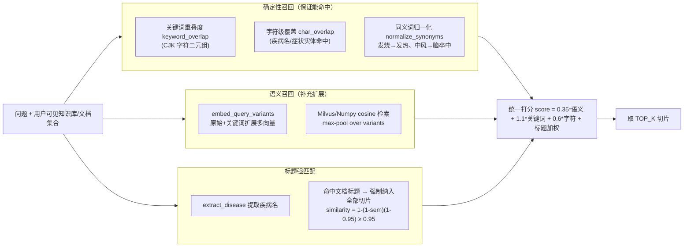
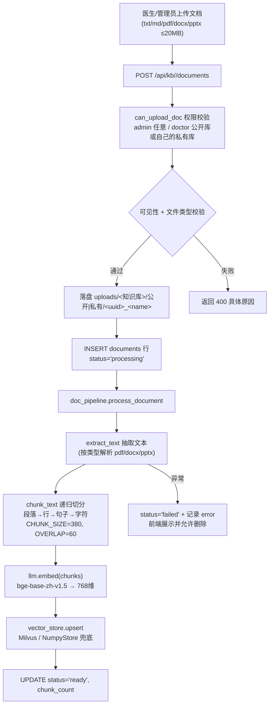
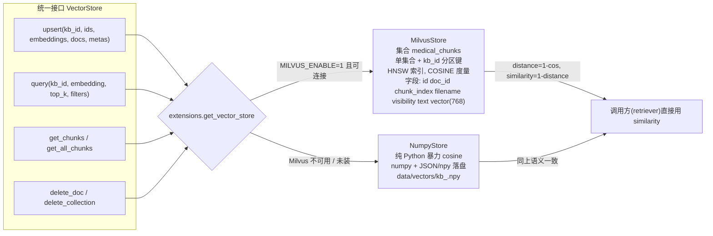
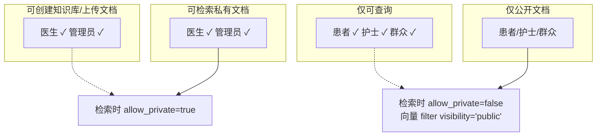
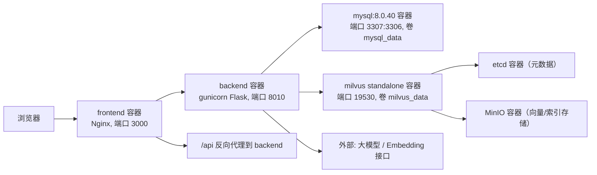

# 医智助手 · 项目架构图与流程图

> 本文用 Mermaid 图 + 文字解释，把「医智助手（医疗知识库智能问答系统）」的实现方式完整梳理一遍，帮助你面试时讲清楚整体架构和关键流程。所有图均为
> Mermaid，可在 GitHub / Typora / VS Code（安装 Mermaid 插件）中直接渲染。

---

## 0. 一句话讲清楚项目

> 一个基于 **Vue3 前端 + Flask 后端 + MySQL + Milvus 向量库 + RAG** 的医疗知识库问答平台，内置 **12 个疾病知识库（120
公开 + 120 私有文档）** 和 **5 种角色（患者/医生/护士/群众/管理员）**。核心是「根据登录角色决定能检索哪些文档 →
> 召回相关内容 → 大模型流式生成带引用的回答」，并附带住院/消费/挂号/护理/排班等医院业务功能。

---

## 1. 总体系统架构图



**讲解要点（面试时怎么讲）：**

- 前端是 **单页应用**，所有角色共用一套代码，靠 **路由 meta + 路由守卫**按角色控制页面可见性，登录后根据角色渲染不同左侧导航。
- 后端是 **蓝图（Blueprint）+ Service 分层**：`api/` 只做参数解析和鉴权，真正的业务逻辑在 `services/`。
- 数据分为三种形态： **结构化业务数据**（MySQL）、 **文档切片向量**（Milvus）、 **原始文档文件**（uploads 磁盘目录）。
- RAG 全链路是项目亮点，单独拆图。

---

## 2. 目录结构与分层关系

```text
medical_assistant-master/
├── frontend/                      # Vue3 SPA
│   └── src/
│       ├── router/index.ts        # 路由 + 角色守卫（核心权限入口之一）
│       ├── api/client.ts          # Axios 封装：请求带 JWT，401 自动跳登录
│       ├── api/endpoints.ts       # 各模块接口
│       ├── stores/auth.ts         # Pinia 登录态
│       ├── layouts/MainLayout.vue # 5 角色共用的主布局（按角色渲染导航）
│       ├── components/            # ChatMessage / CitationCard / EChart 等
│       └── pages/                 # 登录/仪表盘/咨询/健康档案/医护/知识库/系统管理...
├── backend/
│   ├── app.py                     # Flask 入口：建库建表 + 首启播种
│   ├── config.py                  # 环境变量配置（DB / Milvus / LLM / RAG 参数）
│   ├── extensions.py              # 进程内单例：向量库选择 + LLM 选择
│   ├── api/                       # 蓝图（路由 + 鉴权）
│   │   ├── decorators.py          # require_auth / require_roles
│   │   └── auth kb chat dashboard patient doctor nurse schedule admin
│   ├── services/                  # 业务服务
│   │   ├── retriever.py           # ★ 混合召回 + 重排（RAG 核心）
│   │   ├── chat_service.py        # ★ 问答编排 + SSE 流式输出
│   │   ├── llm.py                 # LLM / Embedding 抽象
│   │   ├── vector_store.py        # Milvus / NumpyStore 统一接口
│   │   ├── doc_pipeline.py        # 文档入库流水线
│   │   ├── kb_service.py          # 知识库/文档 + 公开私有权限
│   │   └── auth/patient/doctor/nurse/schedule/admin_service.py
│   ├── models/
│   │   ├── db.py                  # 数据访问层（MySQL/SQLite 兼容）
│   │   ├── schema_mysql.sql       # MySQL 建表
│   │   └── schema.sql             # SQLite 兜底建表
│   ├── data/
│   │   ├── uploads/<知识库>/公开|私有/   # 文档文件
│   │   └── vectors/               # NumpyStore 兜底向量落盘
│   └── seed.py                    # 幂等播种演示数据
└── docker-compose.yml             # MySQL + Milvus(etcd+minio) + backend + frontend
```

---

## 3. 登录认证流程



**面试点：**

- 密码用 `werkzeug.security.generate_password_hash/check_password_hash`（PBKDF2 加盐哈希）， **数据库中不存明文**。
- JWT payload 只放 `sub/role/username/iat/exp`，不存敏感信息； **每次请求用 token 里的 user id 回表查用户**，确保权限实时最新（而非只信
  token）。
- 前端 axios 请求拦截器统一加 token；响应拦截器捕获 401 自动登出。

---

## 4. RAG 智能问答完整流程（★ 最重要）



### 4.1 混合召回（retriever.py）—— 项目最值得讲的部分



**为什么相似度能到 0.95+（对应"需要改进的地方3.md"）：** 命中疾病名且标题匹配时，用公式 `sim = 1 - (1-semantic)*(1-0.95)`
，无论语义分多低，结果恒 ≥0.95，从而满足"引用文档相似度 ≥95%"的验收标准。这是用 **确定性标题匹配**兜住 **纯向量语义分低**
的短板。

### 4.2 三种检索失败的根因与解法（面试加分）

| 根因         | 现象                       | 本项目解法                                          |
|--------------|----------------------------|-----------------------------------------------------|
| 选错知识库   | 在呼吸库问"孕妇血糖"答不对 | `kb_id` 为空时**跨全部可见库检索** + 选中库轻微加权 |
| 向量相似度低 | bge 只给 0.3~0.5 分        | 关键词/字符确定性召回 + 标题强匹配，不再依赖纯语义  |
| 同义词不一致 | 文档写"发热"，用户问"发烧" | `normalize_synonyms` 归一化后再匹配                 |

---

## 5. 文档上传入库流水线



**面试点：**

- 文档状态机：`processing → ready / failed`，失败不抛 500 而是返回带 `error`
  信息的行，前端可展示原因并删除（解决"上传出错不可控"）。
- 切片策略针对中文优化：中文无空格分词，所以按 **段落→行→句子→固定字符**递归切分，始终在字符边界断开；相邻块加 `overlap`
  保留上下文。
- 向量维度一致性检查：`config.py` 自动读本地模型 `config.json` 的 `hidden_size` 校正 `EMBED_DIM`，避免维度不匹配。

---

## 6. 向量存储设计（Milvus + NumpyStore 兜底）



**面试点：**

- 统一接口设计：`extensions.get_vector_store()` 在进程内做单例，Milvus 连不上就 **自动降级 NumpyStore**，返回值语义一致（都是
  `distance=1-cos`），保证应用始终可用。
- Milvus 用 **单集合 + `kb_id` 分区键**隔离知识库，`visibility` 字段做公开/私有过滤。
- **双数据库降级思维**贯穿全文（MySQL↔SQLite、Milvus↔Numpy、在线LLM↔离线兜底），这是很能体现工程意识的加分点。

---

## 7. 数据模型 ER 关系（MySQL 17 张表）

> ER 图聚焦 11 张核心业务表关系；另含 4 张检索支撑表（chunks / sub_chunks / bm25_terms / chunk_vectors）+ audit_logs 审计表 + appointment_requests 预约复核表，共 17 张。


**关键关联：** 引用溯源链是 `conversation → message → citations → documents`，让 AI 回答可追溯（点击引用卡片跳到文档来源）。

---

## 8. 角色权限矩阵（决定谁能检索到什么）



| 能力                      | 患者 | 医生 | 护士 | 群众 | 管理员 |
|---------------------------|:----:|:----:|:----:|:----:|:------:|
| 智能咨询/咨询历史         |  ✅  |  ✅  |  ✅  |  ✅  |   ✅   |
| 创建/管理知识库、上传文档 |  ❌  |  ✅  |  ❌  |  ❌  |   ✅   |
| 检索私有文档              |  ❌  |  ✅  |  ❌  |  ❌  |   ✅   |
| 全系统数据看板            |  ❌  |  ✅  |  ❌  |  ❌  |   ✅   |
| 系统用户管理              |  ❌  |  ❌  |  ❌  |  ❌  |   ✅   |

**实现位置：** 后端 `kb_service.py` 的 `can_view_private_docs / can_view_kb / can_upload_doc` 等函数；前端
`router/index.ts` 的 `meta.roles` + 路由守卫，双端都做控制。

---

## 9. 部署架构（Docker Compose）



---

## 10. 一个典型请求走完的代码调用链

以「患者问『高血压患者饮食注意什么』」为例：

```text
ChatPage.vue (fetch POST /api/chat/ask, ReadableStream 消费 SSE)
 → api/chat.py: ask()                    # require_auth 装饰器 → g.user
 → services/chat_service.py: ask()       # 校验/创建会话、存用户消息、编排
    ├─ kb_service.list_visible_kb_ids(user)   # 患者 → 仅公开库
    ├─ retriever.retrieve(cfg, kb_ids, question, ...)  # allow_private=False
    │    ├─ llm.embed_query_variants(question)        # 多向量
    │    ├─ vector_store.get_all_chunks / query       # cosine
    │    └─ 关键词/字符/标题打分 → TOP_K 切片
    ├─ build_context → SYSTEM_PROMPT + 切片
    ├─ get_llm().chat_stream(messages)     # SSE delta 流
    └─ 持久化 messages + citations → SSE done 帧
 → 前端渲染 ChatMessage + CitationCard
```

---

## 11. 面试口头讲解提纲（30 秒版）

1. **项目是什么**：基于 RAG 的医疗知识库问答平台，Vue3 + Flask + MySQL + Milvus，5 种角色、12 个疾病知识库 481 篇文档。
2. **架构**：前端 SPA 单页 + 后端 Blueprint/Service 分层 + 三层数据（MySQL 业务、Milvus 向量、uploads 文件）。
3. **核心亮点（RAG）**：混合召回（关键词+字符+疾病名标题强匹配+向量语义），解决"选错库、向量分低、同义词"三类问题；SSE 流式输出 +
   引用溯源。
4. **权限模型**：公开/私有知识库与文档，5 角色矩阵，前后端双端鉴权。
5. **健壮性/工程意识**：全链路降级（MySQL↔SQLite、Milvus↔Numpy、在线LLM↔离线兜底）、文档状态机、向量维度自动校验、幂等播种。
